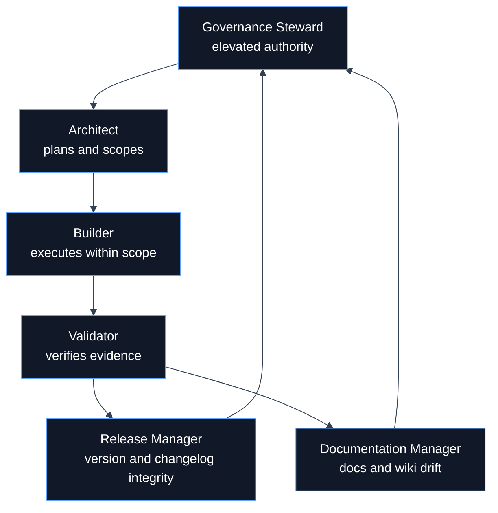

# Agent Roles

 

> **Canonical sources**: [`AGENTS.md`](https://github.com/flynn33/forsetti-agentic-edition/blob/main/AGENTS.md), [`agents/*.md`](https://github.com/flynn33/forsetti-agentic-edition/tree/main/agents)

---

## Role Lattice

---

## Authority Matrix

| Role | Owns | May Not Do | Escalates When |
|---|---|---|---|
| Architect | classification, profile selection, task contract, scope | implement, validate, release | scope or authority is ambiguous |
| Builder | scoped edits, docs updates, changelog entry, evidence | approve own work, expand scope, patch sealed internals | contract is incomplete |
| Validator | compliance decision, evidence review, blocker identification | implement fixes, waive policy | evidence conflicts with claims |
| Release Manager | version impact, changelog integrity, release readiness | bypass compliance gates | breaking-change impact is unclear |
| Documentation Manager | README/wiki/glossary sync, documentation drift | change policy meaning through docs | canonical source and derived page disagree |
| Governance Steward | governance-class approval, protected asset authority | weaken constitutional rules informally | constitutional amendment is required |

---

## Handoff Swimlane

```mermaid
%%{init: {"theme":"base","themeVariables":{"primaryColor":"#0f172a","primaryTextColor":"#ffffff","primaryBorderColor":"#38bdf8","lineColor":"#2563eb","secondaryColor":"#f8fafc","tertiaryColor":"#eff6ff"}}}%%
flowchart LR
    subgraph A["Architect"]
        A1["classify"] --> A2["select profile"] --> A3["contract scope"]
    end
    subgraph B["Builder"]
        B1["execute"] --> B2["document"] --> B3["collect evidence"]
    end
    subgraph V["Validator"]
        V1["check rules"] --> V2["map evidence"] --> V3["decision"]
    end
    subgraph R["Release and Docs"]
        R1["version impact"] --> R2["changelog"] --> R3["wiki alignment"]
    end
    A3 --> B1
    B3 --> V1
    V3 --> R1
```

---

## RACI Snapshot

| Activity | Architect | Builder | Validator | Release | Docs | Steward |
|---|---:|---:|---:|---:|---:|---:|
| Select edition profile | A | C | C | I | I | C |
| Modify scoped files | C | A | I | I | C | I |
| Validate compliance | I | C | A | C | C | I |
| Approve governance-class path | C | I | C | I | I | A |
| Confirm version impact | C | C | C | A | I | C |
| Publish wiki alignment | C | C | C | I | A | I |

Legend: `A` accountable, `C` consulted, `I` informed.

---

## Role Boundary Rule

The same person can perform multiple roles only when the work remains auditable. A Builder may gather validation evidence but does not become the Validator for their own work. A role handoff must leave enough evidence for the next role to independently verify the claim.

---

**Navigation**: [Home](Home) | [Overview](Overview) | [Workflow](Workflow) | [Compliance](Compliance) | [Documentation](Documentation) | [Releases](Releases) | [Glossary](Glossary)
