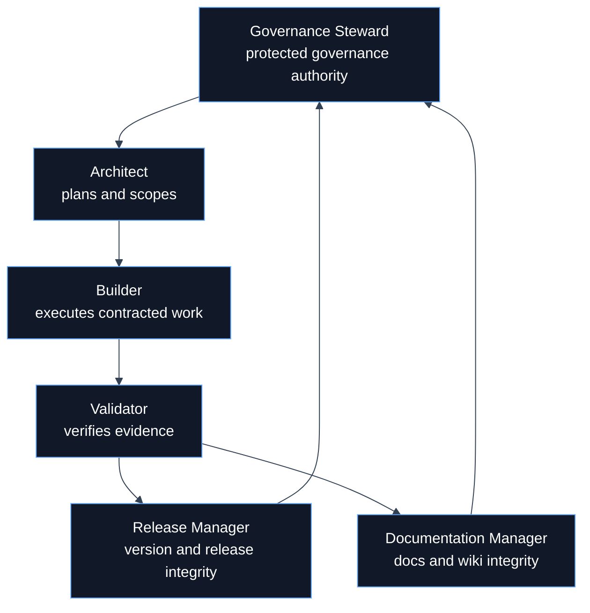
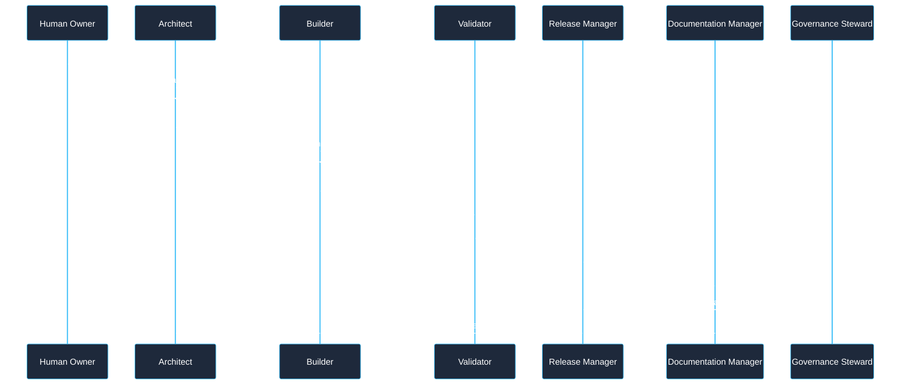
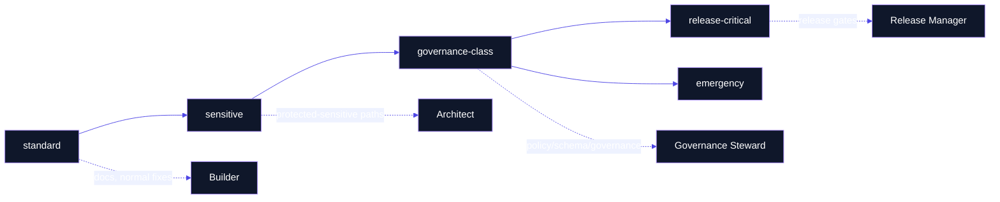

# Agent Roles

> **Canonical sources**: [`AGENTS.md`](https://github.com/flynn33/forsetti-agentic-edition/blob/main/AGENTS.md), [`agents/*.md`](https://github.com/flynn33/forsetti-agentic-edition/tree/main/agents), `policies/agent-roles.json`

---

## Role Lattice

---

## Authority Matrix

| Role | Owns | Must Not Do | Required Evidence |
|---|---|---|---|
| Architect | change classification, approval class, edition profile, task scope, risk boundaries | implement or validate own plan | task contract, scope statement, selected profile |
| Builder | scoped implementation, documentation updates, changelog entry, validation evidence | expand scope, approve own work, bypass sealed boundaries | changed files, command outputs, evidence bundle |
| Validator | compliance decision, scope review, findings, truthfulness check | implement production changes during validation | validator result, finding rationale, unresolved issues |
| Release Manager | version impact, changelog integrity, release readiness | waive compliance or rewrite history casually | version classification, changelog completeness, release gate result |
| Documentation Manager | README/wiki/docs alignment, glossary consistency, drift control | change canonical policy meaning through derived docs | sync evidence, derived page updates, drift decisions |
| Governance Steward | governance-class approval, protected asset authority, constitutional escalation | weaken policy informally | explicit approval record and protected-path rationale |

---

## RACI Grid

| Activity | Architect | Builder | Validator | Release Manager | Documentation Manager | Governance Steward |
|---|---:|---:|---:|---:|---:|---:|
| Classify change | R/A | C | C | C | C | C |
| Select edition profile | R/A | C | C | I | I | C |
| Execute scoped edits | I | R/A | I | I | C | I |
| Produce validation evidence | C | R | A | C | C | I |
| Decide compliance outcome | I | C | R/A | C | C | C |
| Confirm changelog entry | C | R | C | A | C | I |
| Confirm wiki/docs sync | C | R | C | C | A | I |
| Approve governance-class work | C | I | C | C | C | R/A |

R = responsible, A = accountable, C = consulted, I = informed.

---

## Handoff Swimlane

---

## Role Separation Controls

| Risk | Control |
|---|---|
| Builder approves own work | Validator role must independently review scope, findings, and evidence. |
| Release impact is underclassified | Release Manager checks version impact against changelog and versioning policy. |
| Documentation silently changes policy meaning | Documentation Manager keeps derived pages subordinate to canonical sources. |
| Protected paths are modified casually | Protected-path manifest and approval-class gates route the change to higher authority. |
| Completion claims outrun validation | Evidence and validation integrity rule blocks unsupported claims. |

---

## Escalation Ladder

---

## Product Role Checklist

| Before Work | During Work | Before Completion |
|---|---|---|
| contract exists | changed files remain in scope | evidence maps to selected profile |
| edition profile selected | docs/changelog impact tracked | validator or native checks are current |
| authority class known | protected paths are not touched casually | limitations are explicit |
| required outputs named | source bundle verified where used | no derived page drift remains |

---

**Navigation**: [Home](Home) | [Overview](Overview) | [Workflow](Workflow) | [Compliance](Compliance) | [Documentation](Documentation) | [Releases](Releases) | [Changelog](Changelog) | [Constitution](Constitution) | [Glossary](Glossary)
