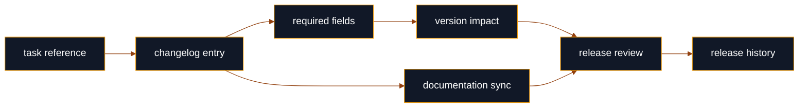
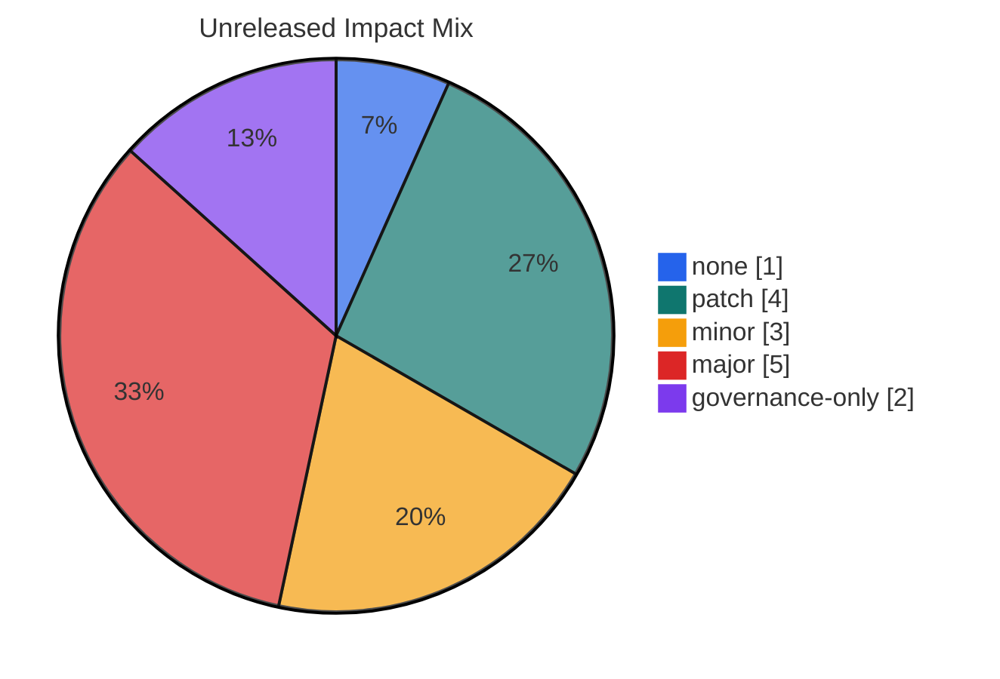
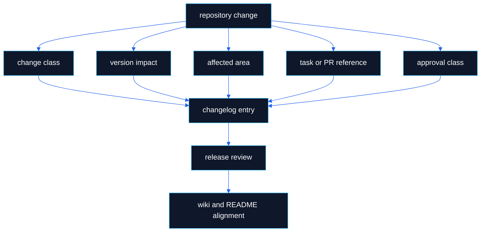
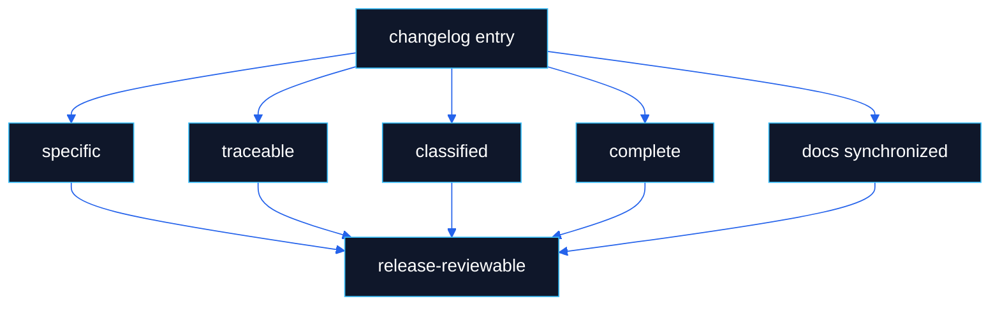

# Changelog

> **Canonical source**: [`changelog/CHANGELOG.md`](https://github.com/flynn33/forsetti-agentic-edition/blob/main/changelog/CHANGELOG.md)
> **Purpose**: visual index for release history, unreleased impact, and traceability. The canonical changelog remains the authoritative ledger.

---

## Ledger Flow

---

## Current Unreleased Queue

| Area | Change | Impact | Traceability |
|---|---|---:|---|
| Release | Final validation acceptance audit | `none` | PR #10 |
| Documentation | Repository documentation product-state alignment | `patch` | PR #15 |
| Documentation | Live wiki visual system refresh | `patch` | PR #12 |
| Documentation | GitHub Actions adapter conversion documentation | `patch` | PR #7 |
| Feature | Native product completion surfaces | `minor` | PR #14 |
| Feature | Platform overlay guidance profiles | `minor` | PR #9 |
| Feature | Portable local validator CLI | `minor` | commit `640453a` |
| Breaking change | Accountability policy surface canonicalization | `major` | PR #13 |
| Breaking change | Forsetti edition-profile enforcement | `major` | PR #11 |
| Breaking change | Accountability without attribution credit | `major` | PR #8 |
| Breaking change | Policy path, documentation, changelog, and release gates | `major` | PR #4 |
| Breaking change | Task contract scope, approval, and evidence enforcement | `major` | PR #3 |
| Breaking change | Canonical compliance rule registry | `major` | commit `7825051` |
| Governance | GitHub Actions adapter workflow protection | `governance-only` | PR #5 |
| Governance | Documentation sync policy manifest paths | `governance-only` | commit `c11a371` |
| Feature | Portable core, adapter, and overlay scaffold | `minor` | commit `9dc9788` |
| Bugfix | Windows validator repository-root resolution | `patch` | commit `62cf174` |

---

## Impact Distribution

---

## Traceability Model

---

## Required Entry Fields

| Field | Required | Purpose |
|---|---:|---|
| Title | yes | names the change in reviewable language |
| Change Class | yes | maps to change control policy |
| Version Impact | yes | maps to release policy |
| Summary | yes | states what changed and why |
| Affected Area | yes | identifies touched product or governance surfaces |
| Task Reference | yes | connects change to an authorizing task, issue, PR, or commit |
| Approval Class | yes | records required authority path |
| Migration Note | breaking only | tells consumers what to do |
| Migration Guidance | breaking only | expands migration steps |
| Affected Consumers | breaking only | names downstream consumers that must adapt |

---

## Release History

| Version | Date | Theme | Included Surfaces |
|---|---|---|---|
| `v1.0.0` | 2026-03-16 | Foundation release | constitution, policies, role instructions, contract templates, standards, policy manifests, schemas, workflows, issue templates, pull request template, CODEOWNERS, labels, wiki seed pages, and validation scripts |

---

## Changelog Quality Bar

---

**Navigation**: [Home](Home) | [Overview](Overview) | [Workflow](Workflow) | [Compliance](Compliance) | [Agent Roles](Agent-Roles) | [Documentation](Documentation) | [Releases](Releases) | [Constitution](Constitution) | [Glossary](Glossary)
