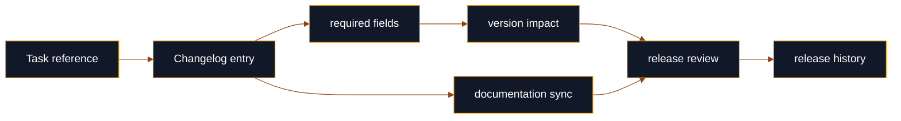
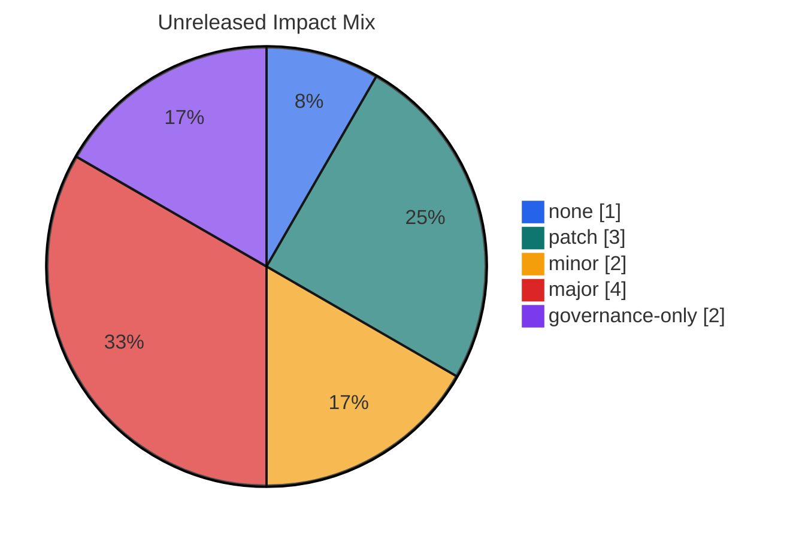

# Changelog

  

> **Canonical source**: [`changelog/CHANGELOG.md`](https://github.com/flynn33/forsetti-agentic-edition/blob/main/changelog/CHANGELOG.md)
> **Purpose**: visual index for release history and pending governance records.

---

## Ledger Flow

---

## Current Unreleased Queue

| Area | Change | Impact | Review Signal |
|---|---|---|---|
| Release | Final validation acceptance audit | `none` | Evidence record only; no framework behavior change. |
| Documentation | Live wiki visual system refresh | `patch` | Curated visual pages and durable live-wiki publication from the repository mirror. |
| Documentation | GitHub Actions adapter conversion documentation | `patch` | Documentation and traceability alignment. |
| Features | Platform overlay guidance profiles | `minor` | Additive Apple, Windows, and generic guidance profiles. |
| Features | Portable local validator CLI | `minor` | New repository-local validator entry point. |
| Breaking Changes | Accountability without attribution credit | `major` | Consumers must maintain human accountability evidence and avoid attribution credit. |
| Breaking Changes | Policy path, documentation, changelog, and release gates | `major` | Consumers must accept expanded manifest and validator result fields. |
| Breaking Changes | Task contract scope, approval, and evidence enforcement | `major` | Consumers must provide richer task-contract and changed-file evidence. |
| Breaking Changes | Canonical compliance rule registry | `major` | Consumers must align rule identifiers to the machine-readable registry. |
| Governance | GitHub Actions adapter workflow protection | `governance-only` | Adapter workflow scripts require protected-path authority. |
| Governance | Documentation sync policy manifest paths | `governance-only` | Documentation sync rules point at current canonical sources. |
| Bugfixes | Windows validator repository-root resolution | `patch` | Validator root discovery corrected. |

---

## Impact Distribution

---

## Release History

| Version | Date | Theme | Included Surfaces |
|---|---|---|---|
| `v1.0.0` | 2026-03-16 | Foundation release | Constitution, compliance policy, change control, release policy, documentation policy, vision, role instructions, contract templates, standards, policy manifests, validation schemas, workflow enforcement, issue templates, pull request template, CODEOWNERS, labels, wiki seed pages, and guardrail scripts. |

---

## Entry Quality Bar

---

<strong>Canonical Detail</strong>

This page is an index. The full authoritative changelog entries, including task references, approval classes, migration guidance, affected consumers, and detailed summaries, remain in [`changelog/CHANGELOG.md`](https://github.com/flynn33/forsetti-agentic-edition/blob/main/changelog/CHANGELOG.md).

---

**Navigation**: [Home](Home) | [Overview](Overview) | [Workflow](Workflow) | [Compliance](Compliance) | [Agent Roles](Agent-Roles) | [Documentation](Documentation) | [Releases](Releases) | [Glossary](Glossary)
