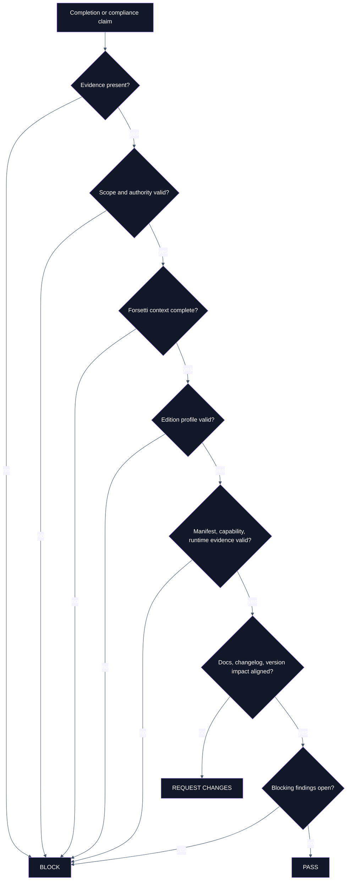
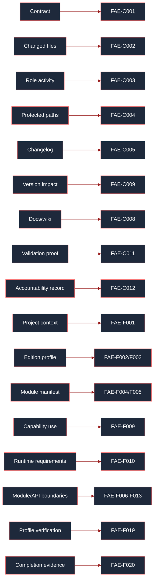
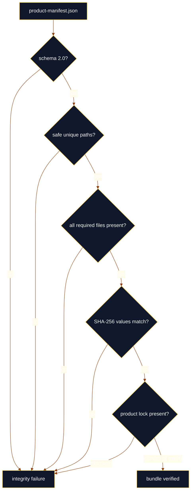

# Compliance

> **Canonical sources**: [`COMPLIANCE_POLICY.md`](https://github.com/flynn33/forsetti-agentic-edition/blob/main/COMPLIANCE_POLICY.md), `core/policies/compliance-rules.json`, `core/policies/forsetti-enforcement-rules.json`, `core/policies/accountability-rules.json`

---

## Decision Lattice

---

## Rule Family Map

| Family | Range | Count | Governs | Typical Result |
|---|---:|---:|---|---|
| Core compliance | `FAE-C001` - `FAE-C012` | 12 | contracts, scope, roles, protected assets, changelog, evidence, release integrity, documentation, accountability | request changes or block |
| Forsetti enforcement | `FAE-F001` - `FAE-F020` | 20 | project context, edition profiles, manifests, capability use, runtime requirements, module isolation, public API use, dependency direction, verification evidence | block when invariants fail |
| Policy gates | policy-local IDs | varies | PR templates, path protection, version impact, docs sync, changelog fields | request changes or block |
| Native product checks | command condition IDs | command-local | bundle integrity, init, doctor, discovery, version reporting | pass, request changes, block, or integrity failure |

---

## Core Compliance Rule Matrix

| Rule | Title | Product Meaning |
|---|---|---|
| `FAE-C001` | Task Contract Required Before Execution | Meaningful work must begin from an explicit governed contract. |
| `FAE-C002` | Scope Boundary Enforcement | Changed files and behavior must stay inside approved scope. |
| `FAE-C003` | Role Separation Enforcement | Planning, building, validation, release, and documentation authority cannot collapse into one unchecked role. |
| `FAE-C004` | Protected Asset Governance Gate | Protected paths require the correct approval class and reviewer path. |
| `FAE-C005` | Changelog Entry Required for Substantive Changes | Meaningful product, policy, docs, release, or governance changes must be traceable. |
| `FAE-C006` | Breaking Change Disclosure Mandate | Breaking changes require migration notes and affected consumers. |
| `FAE-C007` | Completion Summary Truthfulness | Completion claims must match actual code, docs, tests, and limitations. |
| `FAE-C008` | Documentation Sync Compliance | Canonical and derived docs must remain aligned or carry an approved deferral. |
| `FAE-C009` | Version Classification Accuracy | Version impact must match actual consumer impact. |
| `FAE-C010` | Governance Change Isolation | Governance changes must not hide unrelated behavior changes. |
| `FAE-C011` | Evidence and Validation Integrity | Validation evidence must be real, current, and accurately reported. |
| `FAE-C012` | Accountability and Non-Attribution | Human accountability is required; attribution credit to tools or automation is prohibited. |

---

## Forsetti Enforcement Rule Matrix

| Rule | Title | Blocking Condition |
|---|---|---|
| `FAE-F001` | Forsetti project context required | Target work starts without required repository mode, edition, platform, version, manifest, capability, runtime, or API-boundary context. |
| `FAE-F002` | Edition/version profile required | No selected Apple, Windows, or shared profile is available for validation. |
| `FAE-F003` | Target platform must match edition profile | Target platform is outside the selected profile. |
| `FAE-F004` | Valid Forsetti manifest required | Manifest is absent, malformed, or not schema/template `1.1` where required. |
| `FAE-F005` | Manifest/code identity match required | Manifest identity does not match the target module or code surface. |
| `FAE-F006` | Module isolation required | Module boundaries are crossed directly. |
| `FAE-F007` | Direct module dependency prohibited | Governed modules depend on each other directly. |
| `FAE-F008` | Direct module data sharing prohibited | Modules share data outside approved public contracts. |
| `FAE-F009` | Declared capability required before use | Code uses a capability not declared in the manifest. |
| `FAE-F010` | Runtime requirements required for I/O/UI/data isolation | Runtime requirements are absent or incomplete. |
| `FAE-F011` | Public Forsetti API only | Consumer code reaches beyond public products. |
| `FAE-F012` | Sealed framework internals protected | Framework internals are patched or referenced directly. |
| `FAE-F013` | One-way dependency direction required | Core/platform/host dependency direction is inverted. |
| `FAE-F014` | UI/app active surface invariant required | UI/app modules lack the active surface requirement. |
| `FAE-F015` | Service module UI contribution prohibited | Service modules attempt to contribute UI. |
| `FAE-F016` | Constructor dependency injection required | Dependencies are hidden or created outside the governed contract. |
| `FAE-F017` | Hidden globals/service-location prohibited | Hidden global state or service-location bypasses the boundary. |
| `FAE-F018` | Platform-native toolchain required | Required native verification path is skipped or replaced without authorization. |
| `FAE-F019` | Required verification commands must run | Profile-required verification is absent or inaccurately reported. |
| `FAE-F020` | Completion evidence must map to selected edition profile | Evidence does not prove the selected profile obligations. |

---

## Enforcement Coverage Diagram

---

## Decision Table

| Evidence State | Scope State | Rule State | Decision |
|---|---|---|---|
| missing | any | any | block |
| present | outside scope | any | block |
| present | inside scope | protected path without approval | block |
| present | inside scope | invariant violation | block |
| present | inside scope | docs/changelog/version gap | request changes |
| present | inside scope | no unresolved required findings | pass |

---

## Native Integrity Checks

Bundle verification is the native command family that most directly maps to product integrity. Apple and Windows implementations both fail closed for missing or invalid bundle manifests, unsafe paths, missing required files, and hash mismatches.

---

**Navigation**: [Home](Home) | [Overview](Overview) | [Workflow](Workflow) | [Agent Roles](Agent-Roles) | [Documentation](Documentation) | [Releases](Releases) | [Changelog](Changelog) | [Constitution](Constitution) | [Glossary](Glossary)
