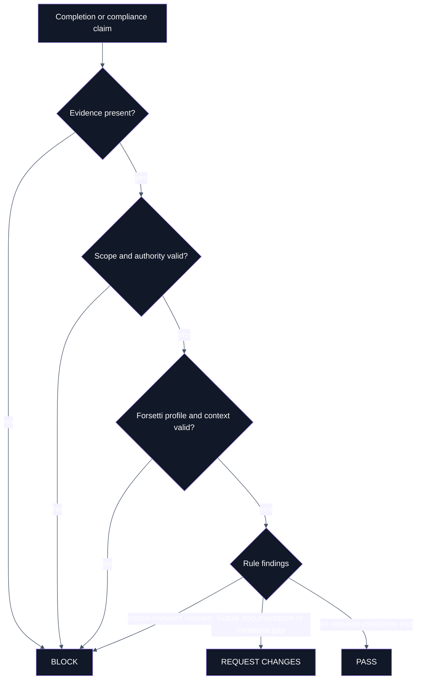
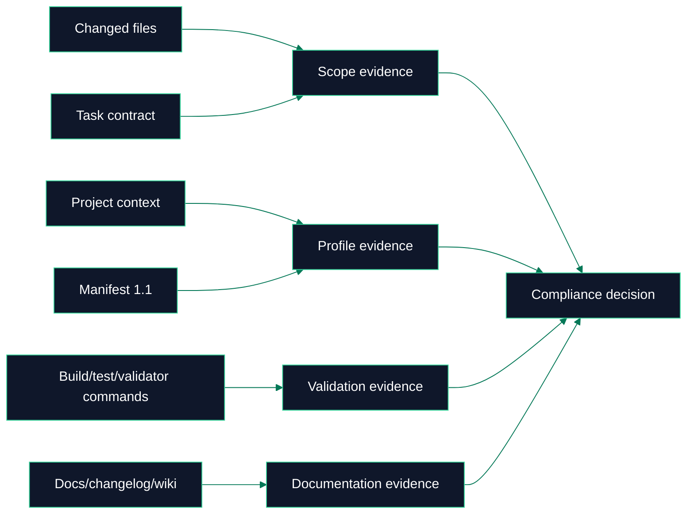

# Compliance

 

> **Canonical source**: [`COMPLIANCE_POLICY.md`](https://github.com/flynn33/forsetti-agentic-edition/blob/main/COMPLIANCE_POLICY.md)
> **Machine-readable registries**: `core/policies/compliance-rules.json`, `core/policies/forsetti-enforcement-rules.json`

---

## Decision Lattice

---

## Rule Families

| Family | Range | Governs | Typical Outcome |
|---|---|---|---|
| Core compliance | `FAE-C001` - `FAE-C012` | contracts, scope, roles, protected paths, changelog, evidence, release classification | block or request changes |
| Forsetti enforcement | `FAE-F001` - `FAE-F020` | project context, profiles, manifests, capabilities, module isolation, dependency direction, public API use | block when architectural invariants are violated |
| Policy gates | manifest-local IDs | protected paths, changelog format, docs sync, version impact | policy-specific pass/request/block |

---

## Forsetti Enforcement Matrix

| Rule | Focus | Blocks When |
|---|---|---|
| `FAE-F001` | Project context | Edition/profile/platform/module context is missing. |
| `FAE-F002` | Edition profile | Apple or Windows profile is absent or malformed. |
| `FAE-F003` | Target platform | Platform does not match selected profile. |
| `FAE-F004` | Manifest validity | Manifest is missing, invalid, or unsupported. |
| `FAE-F005` | Manifest/code identity | Code identity and manifest identity diverge. |
| `FAE-F006` | Module isolation | Module boundaries are pierced. |
| `FAE-F007` | Direct dependency | Module-to-module direct dependency appears. |
| `FAE-F008` | Data sharing | Direct shared storage or database coupling appears. |
| `FAE-F009` | Capabilities | Code uses undeclared capability behavior. |
| `FAE-F010` | Runtime requirements | I/O, UI, or data-isolation requirements are absent. |
| `FAE-F011` | Public API | Consumer code uses non-public Forsetti internals. |
| `FAE-F012` | Sealed internals | Framework internals are patched or edited. |
| `FAE-F013` | Dependency direction | Reverse or lateral framework dependency appears. |
| `FAE-F014` | UI/app surface | UI/app modules lack required active surface evidence. |
| `FAE-F015` | Service UI boundary | Service modules contribute UI directly. |
| `FAE-F016` | Injection | Dependencies bypass constructor injection. |
| `FAE-F017` | Hidden globals | Service-location or hidden global access appears. |
| `FAE-F018` | Native toolchain | Verification ignores selected platform toolchain. |
| `FAE-F019` | Required commands | Profile-required verification does not run or is not disclosed. |
| `FAE-F020` | Completion evidence | Evidence does not map to the selected edition profile. |

---

## Evidence Standard

---

<strong>High-Risk Signals</strong>

- A changed file lives under `core/policies`, `core/schemas`, `core/contracts`, `core/validator`, `schemas`, `scripts`, or root policy documents.
- A task changes governance rules and implementation behavior together.
- A completion claim says a command passed but the command was not run.
- A manifest changes without edition-profile evidence.
- A module imports, includes, calls, or stores data directly with another module.

---

**Navigation**: [Home](Home) | [Overview](Overview) | [Workflow](Workflow) | [Agent Roles](Agent-Roles) | [Documentation](Documentation) | [Releases](Releases) | [Glossary](Glossary)
