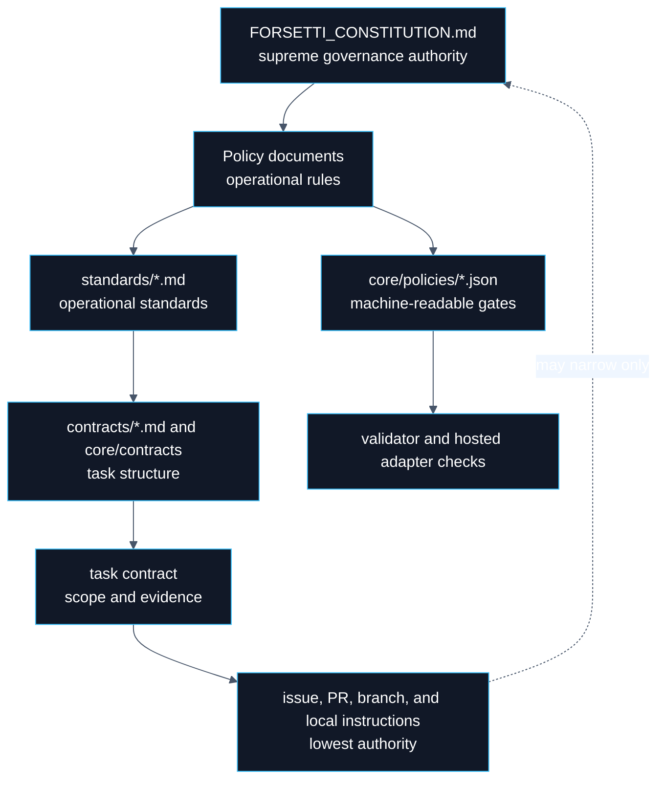
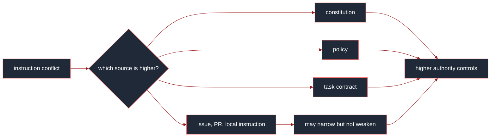
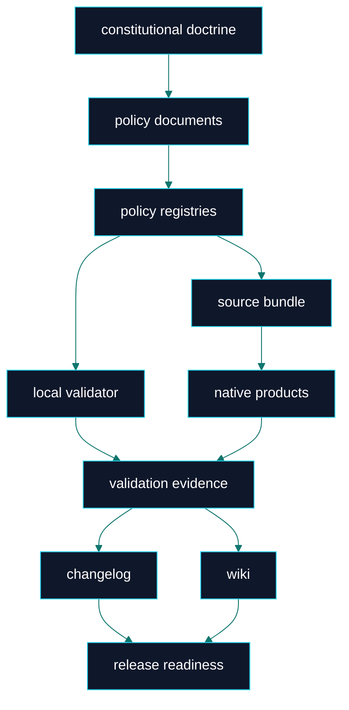

# Constitution

> **Canonical source**: [`FORSETTI_CONSTITUTION.md`](https://github.com/flynn33/forsetti-agentic-edition/blob/main/FORSETTI_CONSTITUTION.md)
> **Purpose**: visual orientation for the highest governing authority. The canonical repository source remains binding.

---

## Authority Stack

---

## Constitutional Doctrine

| Principle | Product Enforcement Meaning | Failure Pattern |
|---|---|---|
| Contract before action | Work starts from scoped authority and evidence requirements. | Implementation begins before scope, outputs, profile, and acceptance criteria are known. |
| Scope is binding | Changed files and behavior stay inside authorized boundaries. | Opportunistic cleanup or hidden expansion enters the change. |
| Truthfulness is mandatory | Completion claims map to observable evidence. | Build, test, release, or wiki claims outrun proof. |
| Governance overrides convenience | Required review and validation gates remain mandatory. | Speed is used to bypass policy. |
| Documentation is delivery | README, wiki, changelog, and standards stay synchronized with product reality. | Public guidance drifts from code and policy. |
| Compliance is measurable | Decisions come from rules and evidence, not confidence. | Assertions replace validation output. |
| Release integrity is non-negotiable | Version impact and migration obligations are accurate. | Breaking or governance-impacting work is underclassified. |

---

## Authority Conflict Resolution

---

## Immutable Product Boundaries

| Boundary | Constitution-Level Meaning |
|---|---|
| Governance-only product | FFAE governs delivery; it does not become the downstream runtime. |
| Evidence-first completion | No passing claim exists without current proof. |
| Human accountability | Governed delivery records human accountability, not attribution credit to tools or automation. |
| Protected assets | Policy, schema, workflow, release, and governance files require the correct authority path. |
| Derived documentation | Wiki pages explain canonical sources; they do not override them. |
| Release truthfulness | Version impact, changelog, and migration guidance must match consumer impact. |

---

## Constitutional Failure Response

| Failure | Required Response |
|---|---|
| scope expansion | stop, re-scope, or obtain explicit approval |
| missing evidence | block completion claim |
| stale docs | update derived surfaces or document approved deferral |
| underclassified breaking change | reclassify, add migration guidance, identify affected consumers |
| protected path without authority | block until required approval exists |
| unsupported validation claim | replace claim with exact attempted command and failure reason |

---

## Authority To Product Flow

---

**Navigation**: [Home](Home) | [Overview](Overview) | [Workflow](Workflow) | [Compliance](Compliance) | [Agent Roles](Agent-Roles) | [Documentation](Documentation) | [Releases](Releases) | [Changelog](Changelog) | [Glossary](Glossary)
