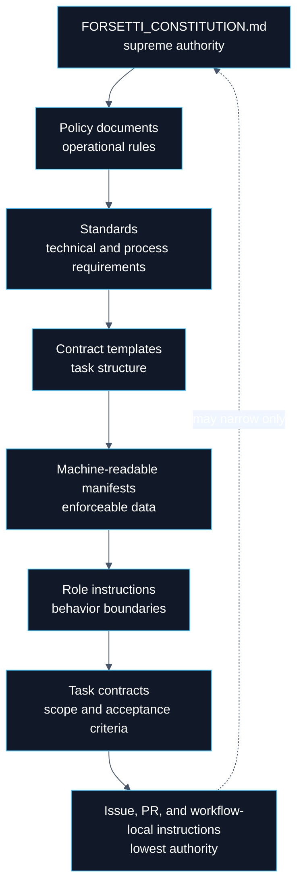
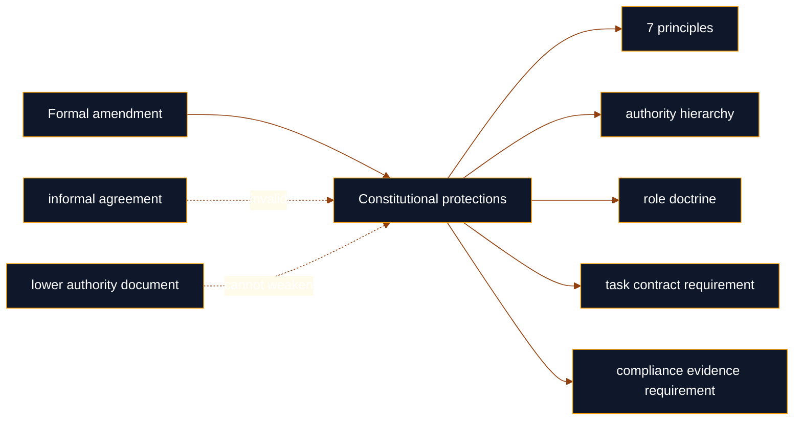
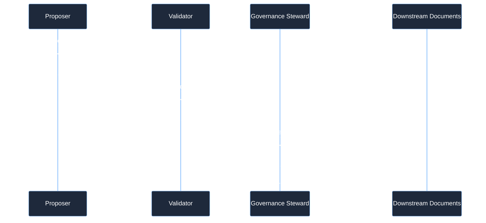

# Constitution

  

> **Canonical source**: [`FORSETTI_CONSTITUTION.md`](https://github.com/flynn33/forsetti-agentic-edition/blob/main/FORSETTI_CONSTITUTION.md)
> **Purpose**: visual orientation for the highest governing authority. The canonical repository source remains binding.

---

## Authority Stack

---

## Foundational Principles

| Principle | Enforcement Meaning | Failure Pattern |
|---|---|---|
| Contract Before Action | Meaningful work starts from an explicit task contract. | Work begins before scope, outputs, and acceptance criteria are known. |
| Scope Is Binding | Changed files and decisions stay inside authorized boundaries. | Opportunistic cleanup or hidden expansion enters the change. |
| Truthfulness Is Mandatory | Claims must map to observable evidence. | Completion, test, release, or review claims outrun proof. |
| Governance Overrides Convenience | Required review, validation, and documentation gates are not optional. | Speed is used to justify bypassing process. |
| Documentation Is Part of Delivery | Docs, changelog, and wiki alignment are delivery artifacts. | Behavior changes while public guidance drifts. |
| Compliance Must Be Measurable | Compliance is decided by evidence, not confidence. | Assertions replace validation outputs. |
| Release Integrity Is Non-Negotiable | Version impact, changelog, and migration guidance must be accurate. | Breaking or governance-impacting work is underclassified. |

---

## Protected Doctrine

---

## Amendment Flow

---

## Escalation Triggers

| Trigger | Required Action |
|---|---|
| Task requires authority beyond the acting role | Stop and escalate before acting. |
| Work touches protected governance assets | Require governance-class authority. |
| Existing policy does not resolve the case | Escalate for authoritative interpretation. |
| Breaking impact appears during non-breaking work | Reclassify the contract before continuing. |
| Evidence is unavailable or inconclusive | Report the gap; do not assert compliance. |
| Governance rules conflict | Escalate to the Governance Steward. |

---

<strong>Constitutional Boundary</strong>

The Constitution governs the framework itself. It defines the precedence order, immutable principles, role boundaries, protected doctrine, prohibited behaviors, and amendment process. It does not replace task contracts, policy manifests, release records, or downstream framework runtime rules. Those surfaces remain valid only when they conform to the Constitution.

---

**Navigation**: [Home](Home) | [Overview](Overview) | [Agent Roles](Agent-Roles) | [Workflow](Workflow) | [Compliance](Compliance) | [Releases](Releases) | [Changelog](Changelog) | [Glossary](Glossary)
