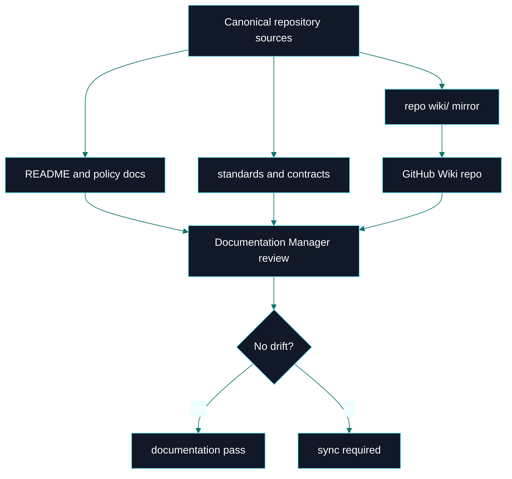
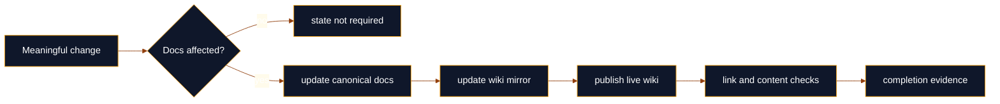

# Documentation

 

> **Canonical source**: [`DOCUMENTATION_POLICY.md`](https://github.com/flynn33/forsetti-agentic-edition/blob/main/DOCUMENTATION_POLICY.md)
> **Publication model**: repository docs and the live GitHub Wiki are separate surfaces that must be aligned intentionally.

---

## Documentation Topology

---

## Publication Surfaces

| Surface | Path | Purpose | Publish Mode |
|---|---|---|---|
| Canonical docs | root markdown, `core/`, `standards/`, `contracts/` | binding source of truth | PR-based repository changes |
| Wiki mirror | `wiki/*.md` | curated derived pages kept with repository review | PR-based repository changes |
| Live wiki | `forsetti-agentic-edition.wiki.git` | public GitHub Wiki pages | direct wiki repository publish |
| Workflow adapter | `adapters/github-actions/workflows/sync-wiki-pages.ps1` | optional hosted publication support | wrapper around repository-local content |

---

## Page System

| Page | Role | Must Stay Aligned With |
|---|---|---|
| [Home](Home) | command center | README, current wiki topology |
| [Overview](Overview) | architecture map | README, `core/`, `editions/`, overlays |
| [Workflow](Workflow) | execution model | AGENTS, change control, documentation policy |
| [Compliance](Compliance) | enforcement model | compliance policy, policy registries |
| [Agent Roles](Agent-Roles) | authority model | AGENTS and role files |
| [Releases](Releases) | release readiness | release policy and changelog |
| [Glossary](Glossary) | shared terms | current policy and schema names |

---

## Drift Control

---

## GitHub Wiki Limits and Best Use

GitHub Wiki pages do not support custom CSS, custom JavaScript, or application-style effects. The highest-quality durable surface is achieved with:

- Mermaid diagrams for architecture, flow, state, and sequence views.
- Dense but readable tables for decision matrices.
- Badges for quick status scanning.
- `
` sections for progressive disclosure.
- Strong page-to-page navigation.
- Consistent canonical-source notes and boundary statements.

---

**Navigation**: [Home](Home) | [Overview](Overview) | [Workflow](Workflow) | [Compliance](Compliance) | [Agent Roles](Agent-Roles) | [Releases](Releases) | [Glossary](Glossary)
