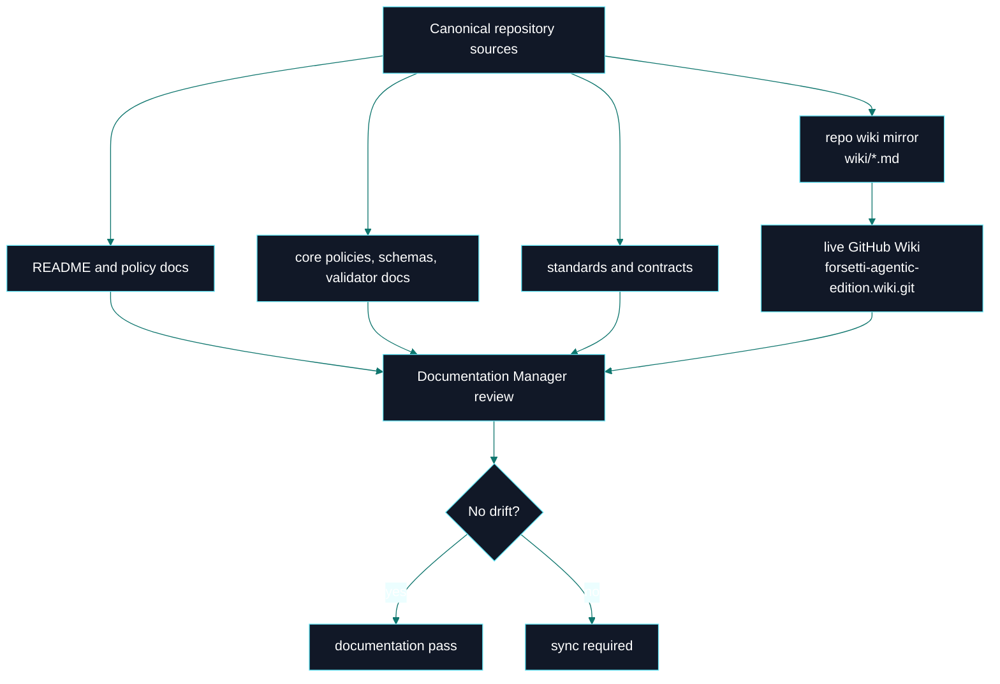
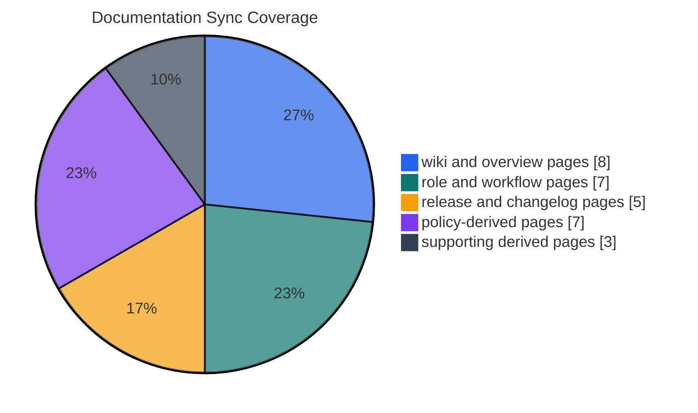
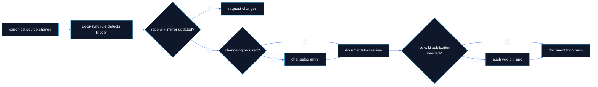

# Documentation

> **Canonical source**: [`DOCUMENTATION_POLICY.md`](https://github.com/flynn33/forsetti-agentic-edition/blob/main/DOCUMENTATION_POLICY.md)
> **Publication model**: repository docs, repository wiki mirror, and the live GitHub Wiki are separate surfaces. They must be aligned intentionally.

---

## Documentation Topology

---

## Publication Surfaces

| Surface | Path | Purpose | Publish Mode |
|---|---|---|---|
| Canonical docs | root Markdown, `core/`, `standards/`, `contracts/` | binding source of truth | PR-based repository changes |
| Wiki mirror | `wiki/*.md` | reviewed, versioned copy of derived public wiki pages | PR-based repository changes |
| Live wiki | `forsetti-agentic-edition.wiki.git` | public GitHub Wiki pages | direct wiki repository publish |
| Hosted adapter | `adapters/github-actions/workflows/sync-wiki-pages.ps1` | optional automation support | workflow wrapper |
| Changelog | `changelog/CHANGELOG.md` | traceable release ledger | PR-based repository changes |

---

## Page Contract

| Page | Canonical Inputs | Required Coverage |
|---|---|---|
| Home | README, product manifest, profiles | current product facts, navigation, command surface snapshot |
| Overview | README, bundle, products, core docs | full architecture, boundaries, inventory, profiles, native product parity |
| Workflow | AGENTS, change control, validator docs, native product code | delivery path, native command lifecycle, PR gates, failure handling |
| Compliance | compliance policy, rule registries | decision lattice, C/F rule matrices, native integrity checks |
| Agent Roles | AGENTS, role docs, role policy | role authority, RACI, handoffs, escalation |
| Documentation | documentation policy, docs-sync rules | canonical/derived/live publication model |
| Releases | release policy, changelog, version files, manifest | current version, impact matrix, release gates |
| Changelog | changelog and changelog rules | current unreleased queue and traceability |
| Constitution | constitution and hierarchy | authority stack and foundational doctrine |
| Glossary | all product surfaces | shared terms tied to enforcement behavior |

---

## Sync Pair Heatmap

The repo currently declares 30 documentation sync pairs. The important operational rule is not the exact distribution; it is that canonical changes must either update the required derived page in the same change or carry an approved deferral.

---

## Publication Pipeline

---

## Visual Quality Rules For GitHub Wiki

| Requirement | GitHub-Wiki-Native Technique |
|---|---|
| high information density | tables, badges, compact ledgers, details blocks |
| architecture clarity | Mermaid flowcharts and layered maps |
| logic clarity | decision lattices, state machines, and sequence diagrams |
| release traceability | changelog tables and impact charts |
| accessibility | text-first tables, direct labels, no hover-only meaning |
| maintainability | diagrams reflect file paths and real command names |
| no drift | page content cites canonical repository paths |

---

## Drift Checklist

- README changes update `wiki/Home.md` and `wiki/Overview.md`.
- Changelog changes update `wiki/Changelog.md`.
- Release or versioning changes update `wiki/Releases.md`.
- Compliance or Forsetti rule changes update `wiki/Compliance.md`.
- Role changes update `wiki/Agent-Roles.md`.
- Documentation policy changes update `wiki/Documentation.md`.
- Live wiki publication is checked separately from repository mirror updates.

---

**Navigation**: [Home](Home) | [Overview](Overview) | [Workflow](Workflow) | [Compliance](Compliance) | [Agent Roles](Agent-Roles) | [Releases](Releases) | [Changelog](Changelog) | [Constitution](Constitution) | [Glossary](Glossary)
