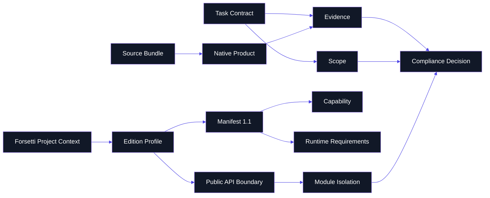

# Glossary

> **Purpose**: shared terminology for interpreting FFAE governance, profiles, validation, native product surfaces, source bundle integrity, and documentation publication.

---

## Concept Graph

---

## Terms

| Term | Meaning |
|---|---|
| Accountability Evidence | Proof identifying the accountable human owner, governed role, contract or phase reference, review evidence, validation evidence, and required approval evidence. |
| Adapter | Optional host integration that translates platform context into repository-local validation inputs. |
| Approval Class | Required authority level for a change: standard, sensitive, governance-class, emergency, or release-critical. |
| Bundle Manifest | `bundle/product-manifest.json`, the schema `2.0` inventory of required bundle files and SHA-256 hashes. |
| Capability | Declared permission or behavior surface that must appear in the manifest before code uses it. |
| Changelog Entry | Required trace record for meaningful changes, including class, impact, affected area, task reference, and approval class. |
| Compliance Decision | Result of validation: pass, request changes, or block. |
| Contract | Task-level governance document defining scope, outputs, evidence, reviewers, and approval path. |
| Derived Surface | Documentation that explains canonical sources but does not override them. The wiki is derived. |
| Documentation Sync Pair | Policy-defined canonical-to-derived documentation relationship that must stay aligned. |
| Edition Profile | Machine-readable Apple or Windows profile binding platform, version, manifest, capability, dependency, and verification expectations. |
| Evidence Bundle | Collected proof that commands ran, findings were addressed, and completion claims map to the selected profile. |
| Forsetti Project Context | Required target context: repository mode, edition, platform, version, module type, manifest status, capability requests, runtime requirements, and API-boundary status. |
| Governance Steward | Elevated authority for governance-class work and protected governance assets. |
| Integrity Failure | Native product result when bundle verification fails closed. |
| Live Wiki | The public GitHub Wiki stored in `forsetti-agentic-edition.wiki.git`. |
| Manifest 1.1 | Current Forsetti module manifest contract used by edition profiles and validator modes. |
| Module Isolation | Rule family requiring modules to avoid direct dependencies and data sharing outside framework contracts. |
| Native Product | Host implementation under `products/apple` or `products/windows`. |
| Policy Gate | Machine-readable rule used by validator or adapter checks to request changes or block. |
| Product Lock | Installed target record that binds a repository to a verified product bundle. |
| Profile Lock | Installed target record that pins the selected edition profile. |
| Public API Boundary | Constraint requiring consumer code to use public Forsetti products only. |
| Release Impact | Version classification: none, patch, minor, major, or governance-only. |
| Source Bundle | Versioned portable package under `bundle/` containing schemas, policies, profiles, instructions, and manifest hashes. |
| Task State | Installed target state showing active governed work and evidence obligations. |
| Validator Mode | Local validator operation such as `repo`, `contract`, `manifest`, `dependencies`, or `evidence`. |
| Wiki Mirror | Repository-tracked `wiki/*.md` page set used for reviewed wiki source content. |

---

## Product Acronyms And IDs

| Identifier | Meaning |
|---|---|
| `FAE-C###` | Core compliance rule identifier. |
| `FAE-F###` | Forsetti-specific enforcement rule identifier. |
| `DOCSYNC-###` | Documentation synchronization policy rule identifier. |
| `CHANGELOG-*` | Changelog policy rule family. |
| `ffae-1.0.0-source` | Current source bundle ID. |
| `product-manifest.schema.json` | Bundle manifest schema for product file inventory. |
| `forsetti-governance` | Native executable name for Apple and Windows command surfaces. |

---

## Term Relationship Table

| If You See | Check This First | Then Check |
|---|---|---|
| missing profile | edition profile path and Forsetti project context | shared invariants |
| module boundary violation | manifest module ID, dependency graph, source roots | `FAE-F006` through `FAE-F013` |
| capability use | manifest `capabilitiesRequested` | profile capability list |
| docs drift | docs-sync rule pair | repo mirror and live wiki |
| release uncertainty | version impact rule | changelog entry and affected consumers |
| bundle failure | product manifest and file hashes | product lock |
| unsupported native command | command matrix | relevant product source |

---

**Navigation**: [Home](Home) | [Overview](Overview) | [Workflow](Workflow) | [Compliance](Compliance) | [Agent Roles](Agent-Roles) | [Documentation](Documentation) | [Releases](Releases) | [Changelog](Changelog) | [Constitution](Constitution)
