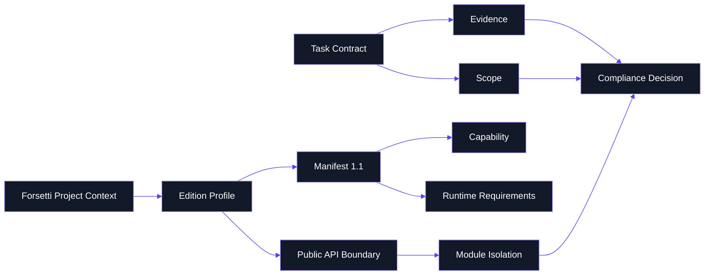

# Glossary

> **Purpose**: shared terminology for interpreting FFAE governance, profiles, validation, and documentation surfaces.

---

## Concept Map

---

## Terms

| Term | Meaning |
|---|---|
| Agent | A governed contributor role operating under FFAE rules. |
| Approval Class | Required authority level for a change: standard, sensitive, governance-class, emergency, or release-critical. |
| Capability | A declared permission or behavior surface that must appear in the manifest before code uses it. |
| Compliance Decision | The result of validation: pass, request changes, or block. |
| Contract | A task-level governance document defining scope, outputs, evidence, and reviewers. |
| Derived Surface | A documentation page that explains canonical sources but does not override them. The wiki is derived. |
| Edition Profile | Machine-readable Apple or Windows profile binding platform, version, tools, capabilities, manifest rules, and verification commands. |
| Evidence | Specific current proof: commands, outputs, changed-file lists, manifests, review records, or reports. |
| Forsetti Project Context | Required pre-execution context: repository mode, edition, target platform, framework version, profile, manifest version, deployment pattern, module type, capabilities, public API status, and internals status. |
| Governance-Class | Elevated approval class for protected governance content. |
| Manifest 1.1 | Module manifest model requiring identity, supported platforms, capabilities, entry point, and runtime requirements. |
| Module Isolation | Rule that modules must not directly import, include, call, or share storage with other module implementation symbols. |
| Public API Boundary | Requirement that consumer code uses public Forsetti contracts and products only. |
| Sealed Internals | Framework implementation surfaces that downstream consumers must not patch or depend on. |
| Source Truth | The authoritative repository or document used to derive profiles, rules, or documentation. |
| Validator Mode | Local validator operation such as repo, contract, manifest, capabilities, or evidence. |

---

## Decision Words

| Word | Use Precisely |
|---|---|
| Pass | Required conditions are met and evidence is present. |
| Request changes | The issue is fixable inside current scope before approval. |
| Block | Work must stop until the governance basis or hard violation is repaired. |
| Not verified | The check did not run or could not run; it is not a pass. |
| Out of scope | The work is not authorized by the current task contract. |

---

**Navigation**: [Home](Home) | [Overview](Overview) | [Workflow](Workflow) | [Compliance](Compliance) | [Agent Roles](Agent-Roles) | [Documentation](Documentation) | [Releases](Releases)
