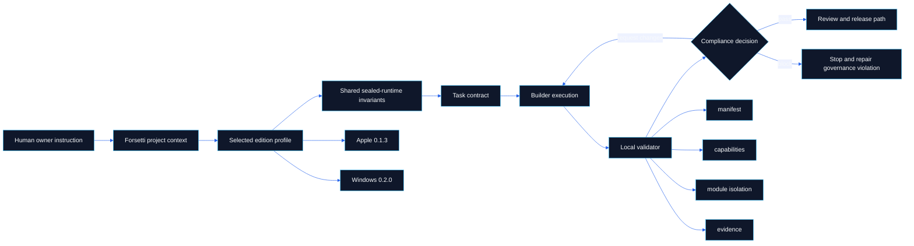

# Forsetti Agentic Edition

   

> **Canonical source**: [`README.md`](https://github.com/flynn33/forsetti-agentic-edition/blob/main/README.md)
> **Wiki purpose**: high-signal orientation for the live GitHub Wiki. Repository files remain authoritative.

---

## Command Center

Forsetti Agentic Edition is a governance-only enforcement framework for Forsetti-compliant applications and modules. It does not implement Apple or Windows runtime behavior. It governs context, profiles, manifests, capabilities, dependency direction, module isolation, public API boundaries, evidence, and release integrity.

| Start Here | Use When | Visual Focus |
|---|---|---|
| [Overview](Overview) | You need the system map and architecture boundaries. | Layer map, source-truth flow, validation surfaces |
| [Workflow](Workflow) | You need the execution path from request to completion. | State machine, sequence flow, evidence gates |
| [Compliance](Compliance) | You need rule outcomes and enforcement families. | Decision lattice, C/F rule matrix, blocker map |
| [Agent Roles](Agent-Roles) | You need role authority and handoff boundaries. | Role lattice, RACI matrix, escalation paths |
| [Documentation](Documentation) | You need wiki and documentation sync rules. | Publication pipeline, drift control, page topology |
| [Releases](Releases) | You need version impact and release readiness. | Release gate model, impact matrix |

---

## Operating Map

---

## Visual Index

| Page | Primary Diagram | What It Proves |
|---|---|---|
| [Overview](Overview) | Portable architecture graph | FFAE is governance-only and profile-bound. |
| [Workflow](Workflow) | Request-to-validation sequence | Execution cannot bypass context, contract, or evidence. |
| [Compliance](Compliance) | Outcome and rule-family lattice | Pass, request-changes, and block are evidence decisions. |
| [Agent Roles](Agent-Roles) | Role authority matrix | Builders execute; Validators verify; Governance Steward escalates. |
| [Documentation](Documentation) | Wiki publication pipeline | Repo wiki mirror and live wiki are separate publish surfaces. |
| [Releases](Releases) | Release readiness gate | Version impact and changelog evidence are mandatory. |
| [Glossary](Glossary) | Concept relationship map | Terms are connected to enforcement behavior. |

---

## Fast Path

1. Choose the [edition profile](Overview): Apple `0.1.3` or Windows `0.2.0`.
2. Complete Forsetti project context before implementation.
3. Bind work to a task contract and authorized scope.
4. Validate manifests, capabilities, dependency direction, public API use, module isolation, and evidence.
5. Publish documentation and changelog updates in the same change set.
6. Report limitations precisely; unavailable checks are not passing checks.

---

## Boundary Statement

FFAE is the governance layer. It does not become the platform runtime, module loader, orchestration server, CLU dependency, MCP dependency, hosted enforcement service, or Apple/Windows framework implementation. Runtime behavior belongs to the downstream Forsetti framework repositories.

---

**Navigation**: [Overview](Overview) | [Workflow](Workflow) | [Compliance](Compliance) | [Agent Roles](Agent-Roles) | [Documentation](Documentation) | [Releases](Releases) | [Changelog](Changelog) | [Glossary](Glossary)
