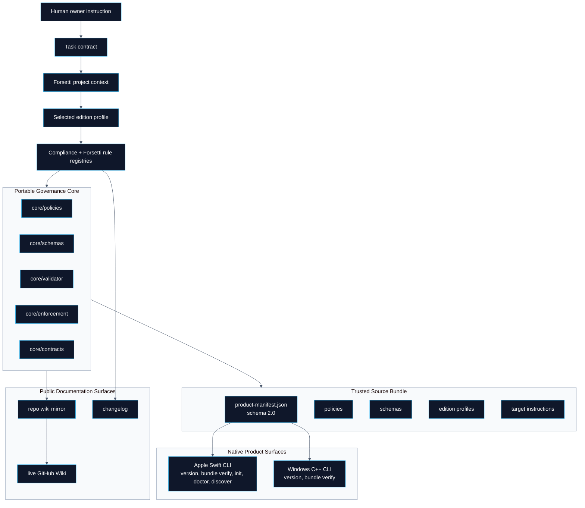
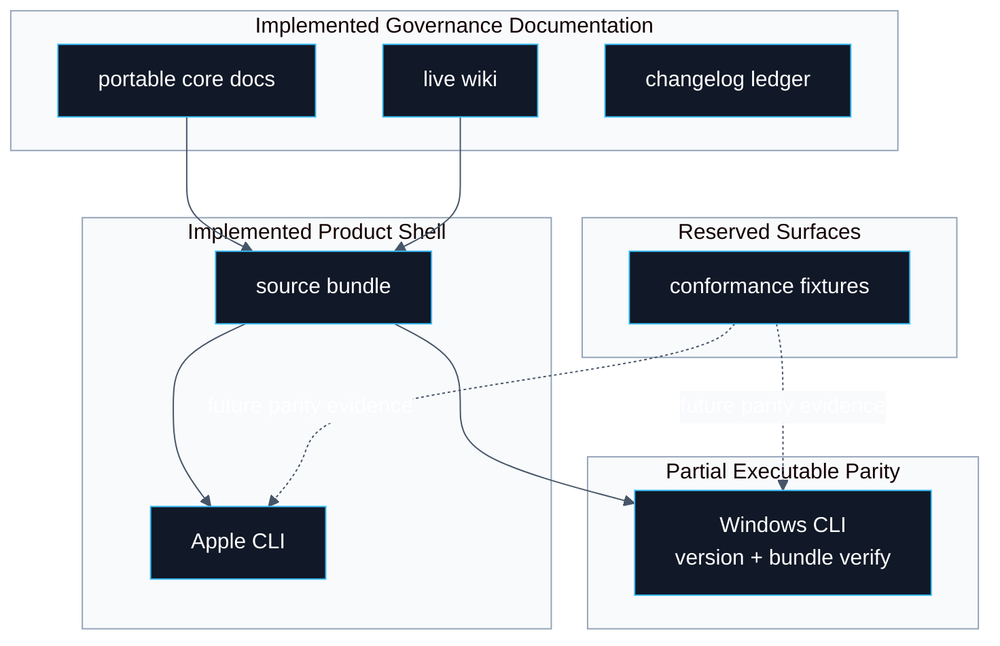

# Forsetti Agentic Edition

> **Canonical source**: [`README.md`](https://github.com/flynn33/forsetti-agentic-edition/blob/main/README.md)
> **Live purpose**: fast, visual, product-aligned orientation for the GitHub Wiki. Repository files remain authoritative.

---

## Product Control Center

Forsetti Agentic Edition is a governance-only enforcement product for Forsetti-compliant application and module delivery. It does not become the downstream runtime. It packages portable governance rules, edition profiles, schemas, source-bundle integrity, native command surfaces, workflow adapters, role boundaries, documentation synchronization, and release evidence into one auditable product.

| Current Product Fact | Value | Evidence Surface |
|---|---:|---|
| Product version | `1.0.0` | `VERSION`, `bundle/VERSION`, native `version` commands |
| Bundle manifest schema | `2.0` | `bundle/product-manifest.json` |
| Required bundle files | `46` | `bundle/product-manifest.json` |
| Compliance rules | `12` | `core/policies/compliance-rules.json` |
| Forsetti enforcement rules | `20` | `core/policies/forsetti-enforcement-rules.json` |
| Documentation sync pairs | `30` | `core/policies/docs-sync-rules.json` |
| Apple profile | `0.1.3`, iOS/macOS | `editions/apple/forsetti-apple-0.1.3.profile.json` |
| Windows profile | `0.2.0`, Windows | `editions/windows/forsetti-windows-0.2.0.profile.json` |

---

## Page System

| Page | Use It For | Primary Visual |
|---|---|---|
| [Overview](Overview) | Whole-product map: core, bundle, profiles, products, adapters, evidence. | Architecture map and command parity matrix |
| [Workflow](Workflow) | Request-to-release and product command paths. | Sequence, state machine, and lifecycle diagrams |
| [Compliance](Compliance) | Rule families, decisions, blockers, and enforcement mapping. | Decision lattice and rule matrix |
| [Agent Roles](Agent-Roles) | Role authority, handoff, review boundaries, and escalation. | RACI grid and swimlane |
| [Documentation](Documentation) | Canonical docs, repo mirror, live wiki, and publication checks. | Publication topology and drift-control loop |
| [Releases](Releases) | Version, changelog, release gates, and product readiness. | Release circuit and impact matrix |
| [Changelog](Changelog) | Current unreleased queue and merged product history. | Impact distribution and traceability ledger |
| [Constitution](Constitution) | Highest authority, doctrine, and hierarchy. | Authority stack and invariant map |
| [Glossary](Glossary) | Shared product and governance terminology. | Concept graph |

---

## Product Map

---

## Command Surface Snapshot

| Command Surface | Implemented Commands | Product Role | Current Limit |
|---|---|---|---|
| Apple native product | `version`, `bundle verify`, `init`, `doctor`, `discover` | Full local product shell for bundle verification, repository bootstrap, installation health, and project discovery. | Apple command surface is the richer native path. |
| Windows native product | `version`, `bundle verify` | C++20 source bundle verification and structured version reporting. | Bootstrap, doctor, and discovery parity are not implemented in the current Windows CLI. |
| PowerShell validator | `repo`, `contract`, `project-context`, `edition-profile`, `manifest`, `dependencies`, `capabilities`, `module-isolation`, `evidence`, `all` | Canonical local validator for repository and target Forsetti checks. | Requires a PowerShell host. |
| GitHub Actions adapter | PR policy, changelog, version, protected path, accountability, docs/wiki helper workflows | Optional hosted automation wrapper around repository-local logic. | Hosted checks are convenience automation, not canonical authority. |

---

## Readiness Board

---

## Operator Fast Path

1. Read [Overview](Overview) to understand the product boundary.
2. Select the target edition profile: Apple `0.1.3` or Windows `0.2.0`.
3. Verify the source bundle before native product operations.
4. Bind all work to a task contract and Forsetti project context.
5. Run the applicable validator modes or native command checks.
6. Update changelog, documentation, and wiki surfaces with the same factual product state.
7. Treat missing validation as a known limitation, never as a passing result.

---

<strong>Boundary Statement</strong>

FFAE governs contracts, profiles, manifests, capabilities, dependency direction, module isolation, public API use, evidence, documentation synchronization, changelog integrity, version classification, and accountability. It does not implement the downstream Forsetti runtime, Apple UI runtime, Windows app runtime, module loader, business-domain logic, deployment platform, hosted service, or platform framework internals.

---

**Navigation**: [Overview](Overview) | [Workflow](Workflow) | [Compliance](Compliance) | [Agent Roles](Agent-Roles) | [Documentation](Documentation) | [Releases](Releases) | [Changelog](Changelog) | [Constitution](Constitution) | [Glossary](Glossary)
