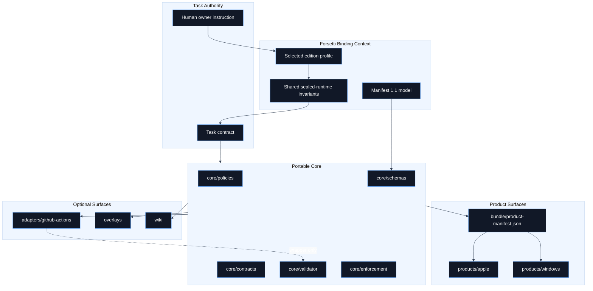
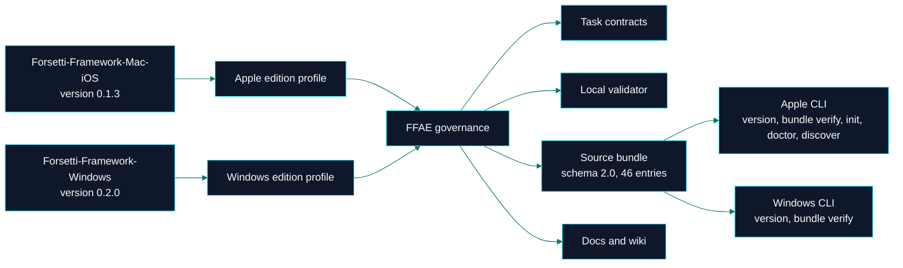

# Overview

 

> **Canonical source**: [`README.md`](https://github.com/flynn33/forsetti-agentic-edition/blob/main/README.md)
> **Model**: portable governance core, optional host adapters, platform overlays, binding edition profiles, source bundle, and native host products.

---

## Architecture at a Glance

---

## Layer Contract

| Layer | Contains | Must Never Become |
|---|---|---|
| Portable core | Policies, schemas, contracts, validator, authority model | Hosted service, runtime SDK, CLU dependency, MCP dependency |
| Edition profiles | Apple `0.1.3`, Windows `0.2.0`, shared invariants | Platform runtime implementation |
| Source bundle | `bundle/` policies, schemas, profiles, target instructions, and manifest hash inventory | Canonical policy authority beyond repository sources |
| Native products | Apple Swift command surface and Windows C++ command surface | Replacement for portable policy, schema, or review authority |
| Adapters | GitHub Actions event translation and wrapper scripts | Canonical compliance authority |
| Overlays | Platform guidance for Apple, Windows, and generic work | Policy override layer |
| Wiki | Derived orientation and visual navigation | Canonical source of truth |

---

## Source-Truth Flow

---

## Enforcement Surfaces

| Surface | Primary Files | Enforcement Question |
|---|---|---|
| Project context | `core/schemas/forsetti-project-context.schema.json` | Is edition, platform, version, module type, and public API status known before work begins? |
| Edition profile | `editions/apple/*`, `editions/windows/*` | Does the selected profile match the target repository and platform? |
| Manifest model | `core/schemas/module-manifest-1.1.schema.json` | Does the module declare identity, capabilities, entry point, and runtime requirements? |
| Rule registry | `core/policies/forsetti-enforcement-rules.json` | Which `FAE-F###` rule decides the result? |
| Validator | `core/validator/forsetti_validate.ps1` | Can the repository or target module produce evidence-backed findings? |
| Product bundle | `bundle/product-manifest.json` | Do bundled schemas, policies, profiles, and instructions match their required hashes? |
| Native products | `products/apple`, `products/windows` | Which host command surface is implemented for bundle verification, bootstrap, or discovery? |
| Documentation | `wiki/*.md`, `README.md`, standards | Does human-facing guidance match canonical policy? |

---

<strong>Boundary Checklist</strong>

- FFAE governs architecture compliance; it does not implement runtime architecture.
- FFAE can inspect target repositories; it does not host target applications.
- Native products verify and apply the source bundle; they do not replace canonical governance sources.
- GitHub Actions may call the local validator; GitHub Actions do not define compliance.
- Local tools may collect evidence; local tools are not authorities.
- Wiki pages explain and visualize; canonical repository files govern.

---

**Navigation**: [Home](Home) | [Workflow](Workflow) | [Compliance](Compliance) | [Agent Roles](Agent-Roles) | [Documentation](Documentation) | [Releases](Releases) | [Glossary](Glossary)
