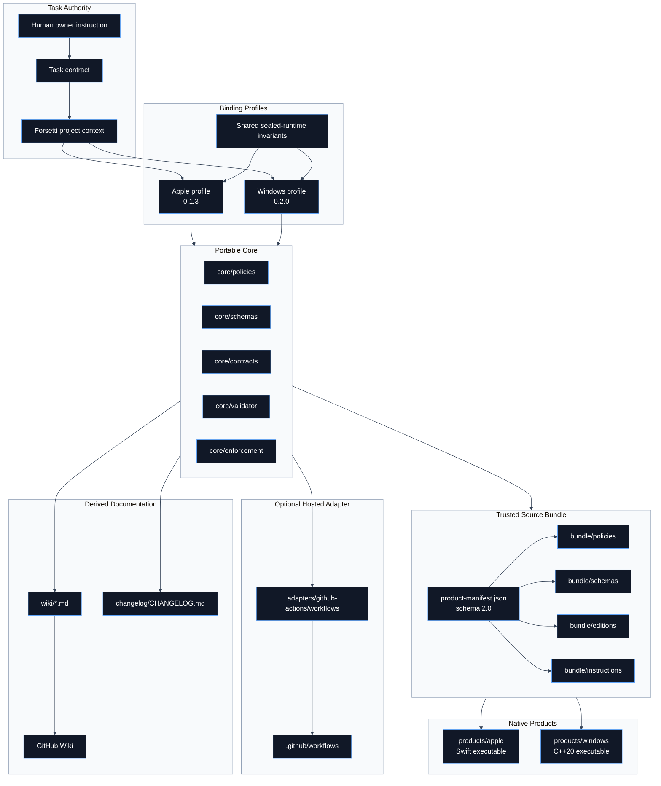
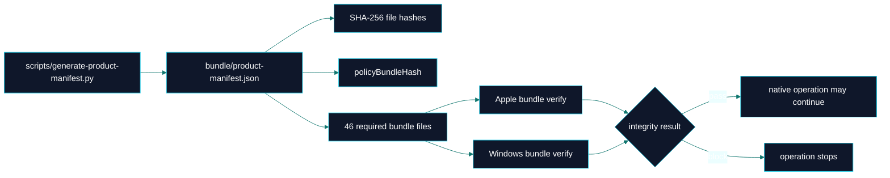

# Overview

> **Canonical source**: [`README.md`](https://github.com/flynn33/forsetti-agentic-edition/blob/main/README.md)
> **Product model**: portable governance core, trusted source bundle, edition profiles, native host products, optional adapters, platform overlays, and derived documentation surfaces.

---

## Architecture At A Glance

---

## Product Inventory

| Layer | Path | Current Contents | Authority |
|---|---|---|---|
| Portable core | `core/` | policy registries, schemas, task contract template, validator, authority model | Canonical where marked by policy hierarchy |
| Edition profiles | `editions/` | Apple `0.1.3`, Windows `0.2.0`, shared invariants | Binding for target work |
| Source bundle | `bundle/` | 46 required hashed files, schemas, policies, profiles, target instructions | Verifiable installation payload |
| Native Apple product | `products/apple/` | Swift package, executable, core/contracts/apple libraries, tests | Native command surface |
| Native Windows product | `products/windows/` | CMake project, C++20 executable, core library, tests | Native command surface |
| GitHub adapter | `adapters/github-actions/` | PowerShell workflow scripts and shared GitHub context helpers | Optional hosted adapter |
| Root scripts | `scripts/` | product manifest generator and validation wrappers | Local utility entry points |
| Evidence | `.forsetti/product-completion/` | Phase 00 through Phase 05 reports | Product completion record |
| Wiki mirror | `wiki/` | reviewed repository copy of public wiki pages | Derived documentation |

---

## Bundle Integrity Contract

| Manifest Field | Current Value |
|---|---|
| `schemaVersion` | `2.0` |
| `product` | `Forsetti Agentic Edition` |
| `version` | `1.0.0` |
| `bundleID` | `ffae-1.0.0-source` |
| `platform` | `source` |
| `architecture` | `portable` |
| `files` | `46` required entries |
| `policyBundleHash` | `2c543bb7562f25918bc2ca03fbc8eec7539ba5c232cf686acb2da26e91e4e95a` |

---

## Native Product Command Matrix

| Command | Apple Swift CLI | Windows C++ CLI | Purpose |
|---|---:|---:|---|
| `version` | Implemented | Implemented | Structured product version result |
| `bundle verify --bundle-root <path>` | Implemented | Implemented | Fail-closed source bundle integrity verification |
| `init --repository-root <path>` | Implemented | Not implemented | Install `.forsetti` layout and governance instructions |
| `doctor --repository-root <path>` | Implemented | Not implemented | Verify installation, locks, instructions, native tools, and task state |
| `discover --repository-root <path>` | Implemented | Not implemented | Inspect build systems and propose module inventory |

---

## Edition Profile Comparison

| Profile | Framework Version | Platforms | Manifest Version | Public Products | Verification Commands |
|---|---:|---|---:|---|---|
| Apple | `0.1.3` | iOS, macOS | `1.1` | `ForsettiCore`, `ForsettiPlatform`, `ForsettiHostTemplate` | guardrail script, Xcode build |
| Windows | `0.2.0` | Windows | `1.1` | `ForsettiCore`, `ForsettiPlatform`, `ForsettiHostTemplate` | CMake configure/build, CTest, PowerShell guardrail script |

---

## Enforcement Surfaces

| Surface | Primary Files | Question Answered |
|---|---|---|
| Project context | `core/schemas/forsetti-project-context.schema.json` | Is edition, platform, version, module type, capability use, runtime status, and public API status known before work begins? |
| Task contract | `core/schemas/task-contract.schema.json`, `core/contracts/task-contract-template.json` | Is the work scoped, authorized, classified, and evidence-bound? |
| Manifest contract | `core/schemas/module-manifest-1.1.schema.json` | Does a module declare required identity, runtime, entry, and capability fields? |
| Rule registries | `core/policies/compliance-rules.json`, `core/policies/forsetti-enforcement-rules.json` | Which rule family decides pass, request changes, or block? |
| Local validator | `core/validator/forsetti_validate.ps1` | Can repository and target checks produce evidence-backed findings? |
| Native products | `products/apple`, `products/windows` | Can the host verify bundle integrity and perform implemented product workflows? |
| Hosted adapter | `.github/workflows`, `adapters/github-actions/workflows` | Can optional hosted checks call repository-owned rules? |

---

## Boundary Ledger

| FFAE Governs | FFAE Does Not Implement |
|---|---|
| contract-first execution | downstream app runtime |
| edition and version profile selection | Apple UI runtime behavior |
| manifest schema/template conformance | Windows app runtime behavior |
| capability declarations before capability use | module loading |
| dependency direction and module isolation | business-domain logic |
| public API and sealed-internal boundaries | deployment platform internals |
| evidence, changelog, release, and docs sync | hosted enforcement service |
| source bundle integrity | platform framework internals |

---

**Navigation**: [Home](Home) | [Workflow](Workflow) | [Compliance](Compliance) | [Agent Roles](Agent-Roles) | [Documentation](Documentation) | [Releases](Releases) | [Changelog](Changelog) | [Constitution](Constitution) | [Glossary](Glossary)
