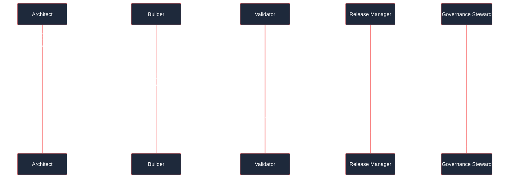
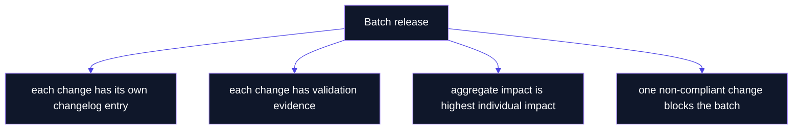

# Releases

  

> **Canonical source**: [`RELEASE_POLICY.md`](https://github.com/flynn33/forsetti-agentic-edition/blob/main/RELEASE_POLICY.md)
> **Current version**: `v1.0.0`

---

## Release Gate Circuit

---

## Version Impact Matrix

| Impact | Meaning | Typical Use | Release Risk |
|---|---|---|---|
| `none` | Presentation, metadata, or formatting with no governed meaning change. | Cosmetic wiki refresh, typo that does not alter meaning. | Low, but still review for drift. |
| `patch` | Correction to existing content without changing policy meaning. | Broken link, schema validation repair, wording fix. | Low to moderate. |
| `minor` | Additive capability or clarification that remains backward compatible. | New guidance profile, new non-breaking template. | Moderate. |
| `major` | Breaking rule, schema, workflow, or consumer obligation change. | Required field change, enforcement behavior change. | High. |
| `governance-only` | Governance posture change that does not map cleanly to semantic versioning. | Protected-path policy, approval-class adjustment. | High review burden. |

---

## Product Surface Snapshot

| Surface | Current State | Release Note |
|---|---|---|
| Repository version | `1.0.0` | No version bump has been applied after the merged product-completion work. |
| Source bundle | `bundle/product-manifest.json` schema `2.0`, 46 required entries | Bundle integrity is verified by native product command surfaces. |
| Apple product | `forsetti-governance` Swift executable | Implements `version`, `bundle verify`, `init`, `doctor`, and `discover`. |
| Windows product | `forsetti-governance` C++20 executable | Implements `version` and `bundle verify`. |

---

## Breaking-Change Path

---

## Required Changelog Fields

| Field | Purpose |
|---|---|
| `title` | Names the change in reviewable language. |
| `change_class` | Classifies feature, bugfix, docs, governance, release, metadata, or breaking-change work. |
| `version_impact` | Records semantic or governance impact. |
| `summary` | States what changed and why. |
| `affected_area` | Identifies touched governance areas. |
| `task_reference` | Links the change to its authorizing task. |
| `approval_class` | Records the required authority path. |
| `migration_guidance` | Required for breaking changes. |
| `affected_consumers` | Required for breaking changes. |

---

## Batch Release Rule

---

<strong>Release Manager Boundary</strong>

The Release Manager confirms version impact, changelog integrity, readiness, and release mechanics. The role does not waive compliance gates, override blocking violations, alter policy content during release preparation, or reclassify breaking changes to reduce review burden.

---

**Navigation**: [Home](Home) | [Overview](Overview) | [Workflow](Workflow) | [Compliance](Compliance) | [Agent Roles](Agent-Roles) | [Documentation](Documentation) | [Changelog](Changelog) | [Glossary](Glossary)
