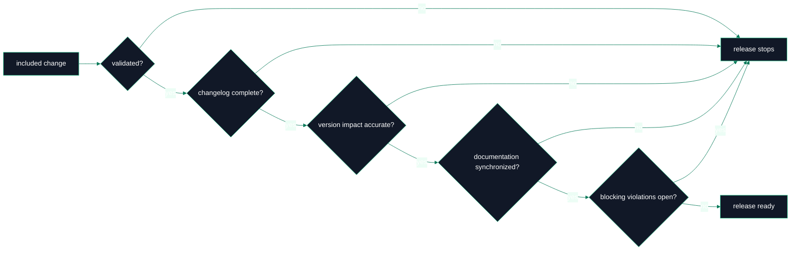
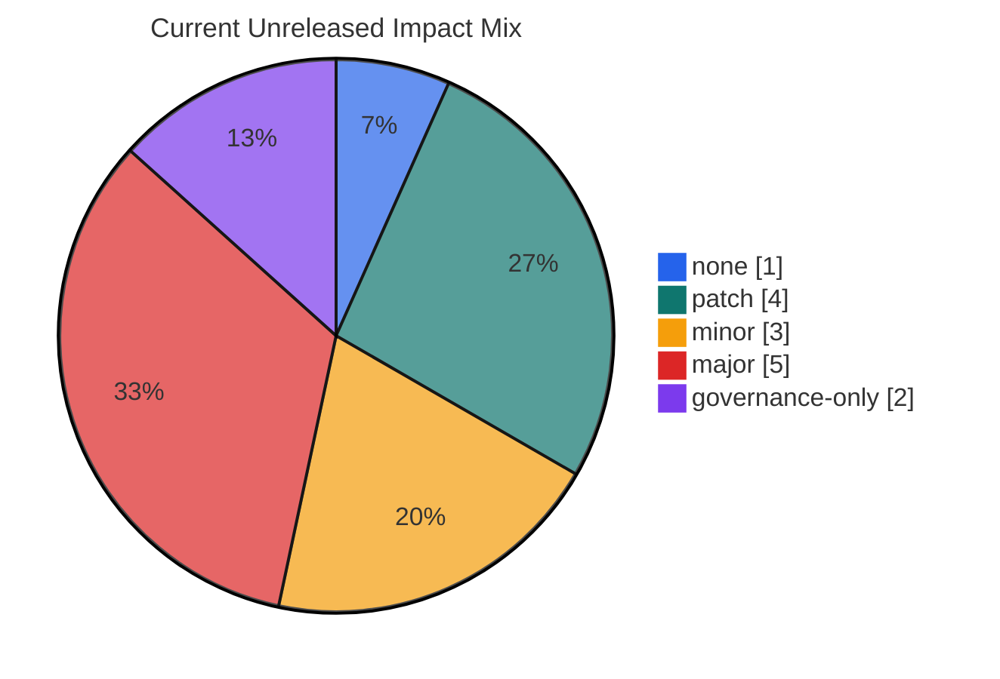
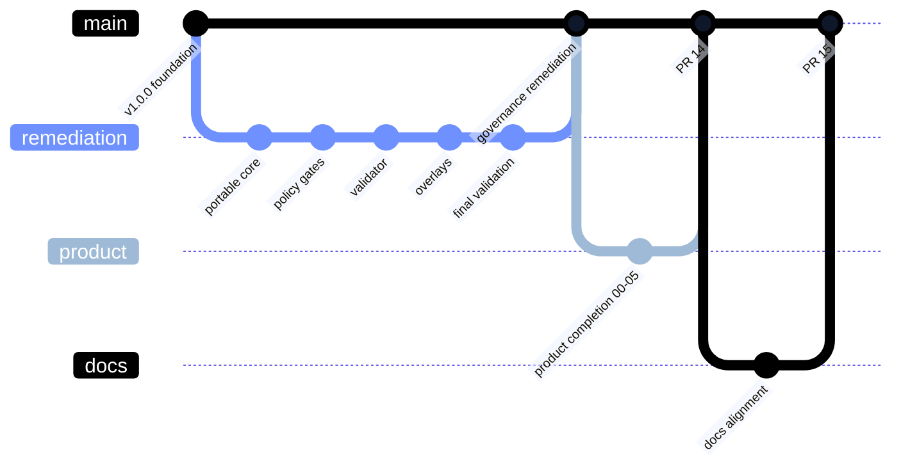

# Releases

> **Canonical source**: [`RELEASE_POLICY.md`](https://github.com/flynn33/forsetti-agentic-edition/blob/main/RELEASE_POLICY.md)
> **Current version**: `v1.0.0`

---

## Current Release Snapshot

| Surface | Current State | Release Meaning |
|---|---|---|
| Repository version | `1.0.0` | No version bump has been applied after product-completion work. |
| Bundle version | `1.0.0` | Source bundle and repository version are aligned. |
| Bundle manifest | schema `2.0`, 46 required files | Product payload is hash-verifiable. |
| Apple product | Swift executable | Implements full current native command shell. |
| Windows product | C++20 executable | Implements version and bundle verification. |
| Release status | Unreleased queue contains major/minor/patch/governance entries | Future release classification must use highest included impact. |

---

## Release Gate Circuit

---

## Version Impact Matrix

| Impact | Meaning | Typical Use | Release Risk |
|---|---|---|---|
| `none` | Evidence, metadata, or presentation with no governed meaning change. | final validation evidence only | low |
| `patch` | Correction to existing content without changing policy meaning. | docs alignment, broken link, wording correction | low to moderate |
| `minor` | Additive backward-compatible capability. | new native command surface, new overlay guidance | moderate |
| `major` | Breaking schema, rule, workflow, or consumer obligation change. | required field change, new blocking enforcement | high |
| `governance-only` | Governance posture change outside normal semantic versioning. | protected path or approval-class change | high review burden |

---

## Product Release Composition

---

## Release Readiness Checklist

| Gate | Required Evidence |
|---|---|
| Version classification | release policy and versioning policy agree with highest included impact |
| Changelog completeness | each meaningful change has title, class, impact, summary, affected area, task reference, approval class |
| Breaking disclosure | breaking entries include migration note, migration guidance, and affected consumers |
| Product bundle | generated manifest matches bundle files and hashes |
| Native product checks | available Apple/Windows checks run or limitations documented |
| Documentation sync | canonical docs, repo wiki mirror, live wiki, and changelog align |
| Attribution guard | prohibited attribution/provider phrases absent |
| Release manager review | release gate evidence is explicit |

---

## Release Timeline

---

## Product Surface Readiness

| Surface | Ready For | Not Yet Claimed |
|---|---|---|
| Source bundle | deterministic hash verification | published release artifact packaging beyond source tree |
| Apple CLI | version, bundle verification, init, doctor, discover | downstream runtime behavior |
| Windows CLI | version, bundle verification | init, doctor, discover parity |
| PowerShell validator | repository and target validation modes | running without a PowerShell host |
| Live wiki | public orientation and visual documentation | canonical authority over source files |

---

**Navigation**: [Home](Home) | [Overview](Overview) | [Workflow](Workflow) | [Compliance](Compliance) | [Agent Roles](Agent-Roles) | [Documentation](Documentation) | [Changelog](Changelog) | [Constitution](Constitution) | [Glossary](Glossary)
