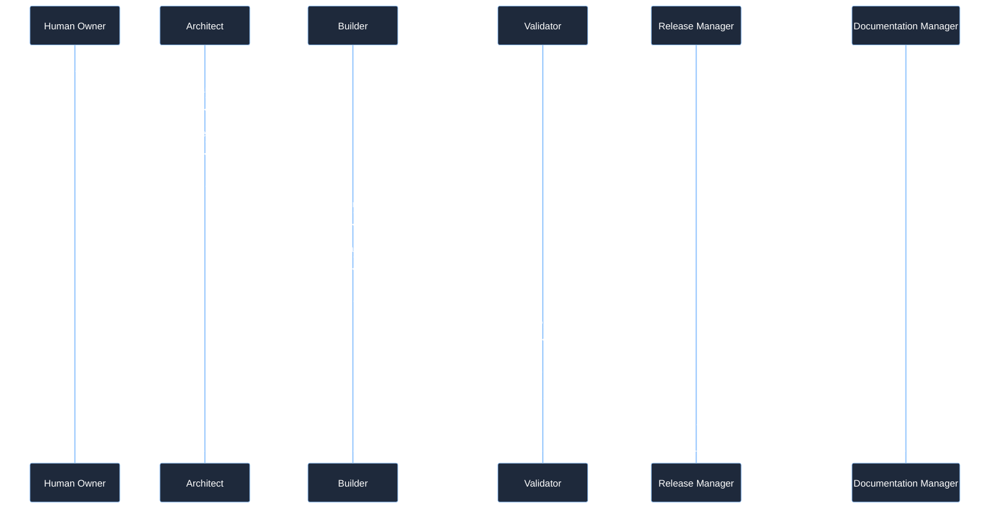
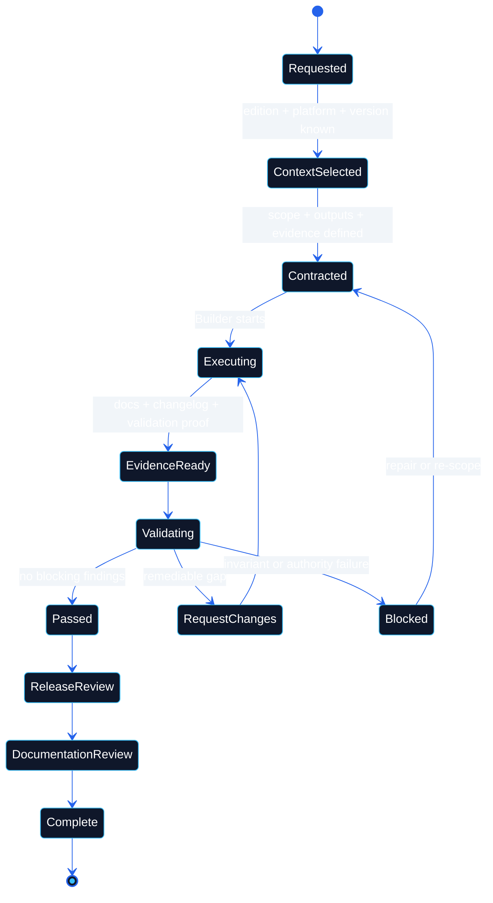
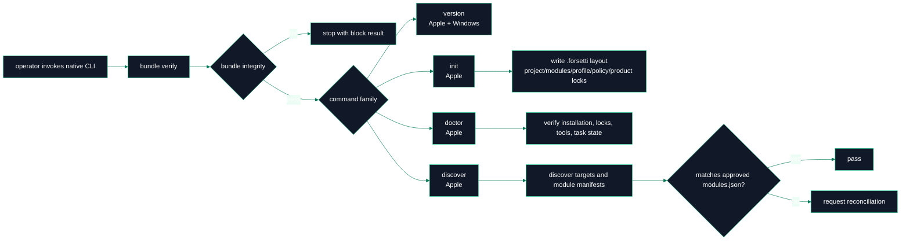
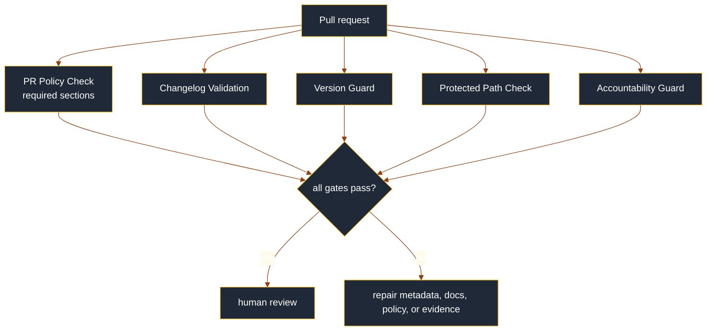

# Workflow

> **Canonical sources**: [`AGENTS.md`](https://github.com/flynn33/forsetti-agentic-edition/blob/main/AGENTS.md), [`CHANGE_CONTROL_POLICY.md`](https://github.com/flynn33/forsetti-agentic-edition/blob/main/CHANGE_CONTROL_POLICY.md), [`DOCUMENTATION_POLICY.md`](https://github.com/flynn33/forsetti-agentic-edition/blob/main/DOCUMENTATION_POLICY.md)

---

## Delivery Pipeline

---

## Governance State Machine

---

## Native Product Lifecycle

---

## Command Flow Details

| Workflow | Inputs | Validation Behavior | Outputs |
|---|---|---|---|
| `version` | optional `--format json` | emits structured product version result | product `1.0.0` |
| `bundle verify` | `--bundle-root` | checks manifest presence, schema, safe paths, duplicates, required files, hashes, optional product lock | pass or integrity failure |
| Apple `init` | repository root, bundle root, optional edition/platform/framework/deployment, `--dry-run` | verifies bundle, requires git repo, resolves profile, installs governed layout atomically | `.forsetti` files and instruction section |
| Apple `doctor` | repository root, bundle root | verifies bundle, install files, instruction section, profile/policy/product locks, native tools, task state | pass/request/block findings |
| Apple `discover` | repository root, bundle root, optional output | verifies bundle, inspects SwiftPM, Xcode, CMake, MSBuild markers, manifests, module edges, source roots | proposed modules inventory and reconciliation findings |

---

## Local Validator Mode Map

| Mode | Scope | Required Inputs |
|---|---|---|
| `repo` | FFAE repository structure and files | repository root |
| `contract` | task contract scope and evidence gates | contract path, changed-file evidence |
| `project-context` | Forsetti target context completeness | project context path |
| `edition-profile` | selected profile shape and fit | edition profile path |
| `manifest` | module manifest conformance | manifest path and selected profile |
| `dependencies` | dependency direction constraints | changed files, profile, target repo evidence |
| `capabilities` | declared capability before use | manifest and changed files |
| `module-isolation` | direct module boundaries | changed files and module inventory evidence |
| `evidence` | completion proof mapped to selected profile | evidence paths and selected profile |
| `all` | repository-local aggregate checks | repository root |

---

## Pull Request Gate Flow

---

## Failure Handling Rules

| Symptom | Correct Response |
|---|---|
| Missing task contract | Stop before implementation and create or request the contract. |
| Missing Forsetti project context | Stop Builder execution until edition, platform, version, manifest, capabilities, and API boundary status are known. |
| Bundle hash mismatch | Treat as integrity failure; do not continue native product operations. |
| Unsupported command | Return invalid usage with a blocking finding. |
| Missing validation tool | Report the exact unavailable tool and do not call the check passing. |
| Docs or changelog drift | Update derived surfaces in the same change or record an approved deferral. |
| Direct module edge discovered | Request reconciliation and route interaction through framework public contracts. |

---

**Navigation**: [Home](Home) | [Overview](Overview) | [Compliance](Compliance) | [Agent Roles](Agent-Roles) | [Documentation](Documentation) | [Releases](Releases) | [Changelog](Changelog) | [Constitution](Constitution) | [Glossary](Glossary)
