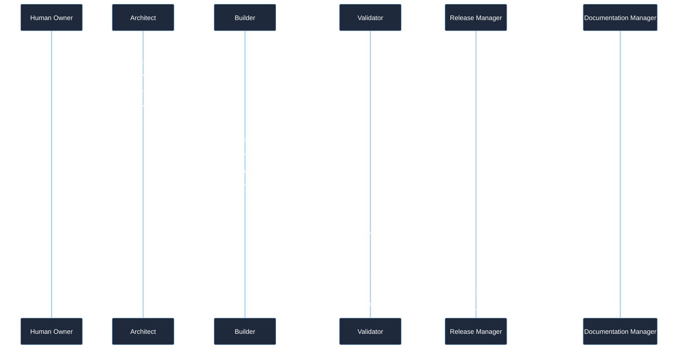
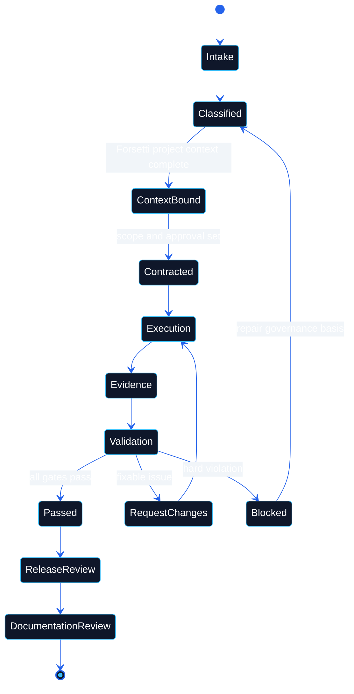

# Workflow

 

> **Canonical sources**: [`AGENTS.md`](https://github.com/flynn33/forsetti-agentic-edition/blob/main/AGENTS.md), [`CHANGE_CONTROL_POLICY.md`](https://github.com/flynn33/forsetti-agentic-edition/blob/main/CHANGE_CONTROL_POLICY.md), [`DOCUMENTATION_POLICY.md`](https://github.com/flynn33/forsetti-agentic-edition/blob/main/DOCUMENTATION_POLICY.md)

---

## Execution Pipeline

---

## State Machine

---

## Mandatory Gates

| Gate | Owner | Blocks When |
|---|---|---|
| Classification | Architect | Change class, approval class, or release impact is missing. |
| Forsetti context | Architect | Edition, platform, framework version, module type, or manifest version is missing. |
| Scope | Architect + Builder | Changed files exceed contract scope. |
| Implementation | Builder | Work touches sealed internals, undeclared capability use, or direct module coupling. |
| Validation | Validator | Evidence is absent, stale, failed, or does not map to the profile. |
| Documentation | Documentation Manager | README, wiki, glossary, changelog, or standards drift from behavior. |
| Release | Release Manager | Version impact or migration guidance is inaccurate. |

---

## Validator Mode Map

| Mode | Use | Evidence Input |
|---|---|---|
| `repo` | FFAE repository structure and mirrors | repository root |
| `contract` | task contract, changed files, protected paths | contract path, changed-file evidence |
| `project-context` | required Forsetti context | project context JSON |
| `edition-profile` | Apple/Windows profile shape and versions | edition profile JSON |
| `manifest` | module manifest 1.1 | manifest JSON |
| `dependencies` | dependency direction and public API use | changed files |
| `capabilities` | capability use versus declarations | changed files and manifest |
| `module-isolation` | module-to-module coupling | changed files |
| `evidence` | completion evidence mapped to profile | contract and validation artifacts |
| `all` | repo plus available target checks | all available inputs |

---

## Failure Handling

| Finding | Decision | Next Move |
|---|---|---|
| Missing contract or context | block | Stop and create the missing governance basis. |
| Protected path without approval | block | Add required approval or split the work. |
| Documentation drift | request changes | Update the affected documentation surface. |
| Missing evidence | block | Run or disclose the required validation. |
| Unavailable tool | request changes or block by policy | State exact command and reason, then provide alternate evidence if allowed. |

---

**Navigation**: [Home](Home) | [Overview](Overview) | [Compliance](Compliance) | [Agent Roles](Agent-Roles) | [Documentation](Documentation) | [Releases](Releases) | [Glossary](Glossary)
